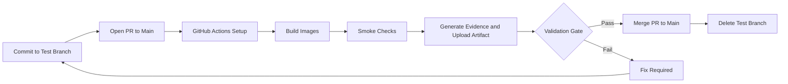

# Lab 05 - DevOps Pipelines and AI-Assisted CI/CD

**Course:** Advanced Software Development with Agentic AI (ASD)
**Theme:** DevOps Pipeline and CI Validation
**Primary IDE:** VS Code (Optional IDE: AWS Kiro)
**AI Runtime:** Ollama
**Duration:** 60 Minutes

## 1. Overview

<details>
<summary>Goal</summary>

Build a GitHub Actions CI pipeline for the Lab 04 Student Enrolment System microservices and capture evidence from each workflow run.

</details>

<details>
<summary>Workflow</summary>

PLAN → BUILD → VALIDATE → COLLECT EVIDENCE → REVIEW

</details>

<details>
<summary>Expected Results</summary>

By the end of this lab, students should have:

- GitHub Actions workflow
- Container build pipeline
- Smoke validation pipeline
- Evidence collection pipeline
- Failure injection and recovery
- Evidence log
- Final CI decision

</details>

---

## 2. Prerequisites and Configuration

<details>
<summary>Prerequisites</summary>

To start this lab, students should have:

Complete:

- Lab 01
- Lab 02
- Lab 03
- Lab 04

Required:

- Docker Desktop
- Git
- GitHub account and repository
- GitHub Actions (enabled on repository)
- GitHub CLI (`gh`)
- Ollama

</details>

<details>
<summary>Environment Verification</summary>

```bash
docker --version
docker-compose --version
git --version
gh --version
ollama list
```
</details>

---

## 3. Scenario

<details>
<summary>Student enrolment app</summary>

Lab 04 extended the Student Enrolment System into a three-service architecture:

- frontend-service
- enrolment-service
- database-service

The business now requires:

- Automated builds
- Automated validation
- Repeatable quality gates
- Auditable CI evidence

No application deployment occurs in this lab.

</details>

<details>
<summary>DevOps Pipeline Flow</summary>



</details>

<details>
<summary>Project Structure</summary>

```text
agentic-ai-asd-2026/
│
├── .github/
│   └── workflows/
│       └── lab5-ci.yml
│
└── enrolment-app-open-ai/
  ├── .env
  ├── .gitignore
  ├── docker-compose.yml
  │
  ├── frontend-service/
  │   ├── Dockerfile
  │   ├── templates/
  │   │   └── index.html
  │   └── css/
  │       └── styles.css
  │
  ├── enrolment-service/
  │   ├── app.py
  │   ├── requirements.txt
  │   ├── Dockerfile
  │   └── prompts/
  │       └── *.txt (all prompt files)
  │
  ├── database-service/
  │   ├── app.py
  │   ├── requirements.txt
  │   ├── init_db.py
  │   ├── Dockerfile
  │   └── data/
  │
  ├── legacy-lab3/
  │   └── (Lab 03 archived files)
  │
  └── reports/
    ├── report.json
    ├── report.md
    └── run-view.md
```
</details>

<details>
<summary>Create Project Workspace</summary>

Use the existing `enrolment-app-open-ai` from Lab 04.

Run these commands from the repository root (`agentic-ai-asd-2026`).

**Linux / macOS**

```bash
cd agentic-ai-asd-2026

mkdir -p .github/workflows
mkdir -p enrolment-app-open-ai/reports

touch .github/workflows/lab5-ci.yml
touch enrolment-app-open-ai/reports/report.json
touch enrolment-app-open-ai/reports/report.md
touch enrolment-app-open-ai/reports/run-view.md
```

**Windows PowerShell**

```powershell
cd agentic-ai-asd-2026

mkdir .github
mkdir .github\workflows
mkdir enrolment-app-open-ai\reports

New-Item .github\workflows\lab5-ci.yml -ItemType File
New-Item enrolment-app-open-ai\reports\report.json -ItemType File
New-Item enrolment-app-open-ai\reports\report.md -ItemType File
New-Item enrolment-app-open-ai\reports\run-view.md -ItemType File
```
</details>

---

## 4. GitHub Actions Workflow

<details>
<summary>Workflow YAML - lab5-ci.yml</summary>

```yaml
name: lab5-ci

on:
  pull_request:
    branches: [main]

  push:
    branches: [main]

jobs:

  build-images:
    runs-on: ubuntu-latest

    steps:
      - uses: actions/checkout@v4

      - name: Verify docker-compose
        run: |
          docker-compose --version || (sudo apt-get update && sudo apt-get install -y docker-compose)

      - name: Build services
        run: docker-compose build
        working-directory: enrolment-app-open-ai

  smoke-check:
    runs-on: ubuntu-latest
    needs: [build-images]

    steps:
      - uses: actions/checkout@v4

      - name: Verify docker-compose
        run: |
          docker-compose --version || (sudo apt-get update && sudo apt-get install -y docker-compose)

      - name: Start services
        run: docker-compose up -d
        working-directory: enrolment-app-open-ai

      - name: Smoke checks
        run: |
          check_url() {
            local url="$1"
            local attempts=8
            local code=""

            for i in $(seq 1 "$attempts"); do
              code=$(curl -sS -o /dev/null -w "%{http_code}" --connect-timeout 5 --max-time 20 "$url" || true)
              if [ "$code" = "200" ]; then
                echo "PASS $url -> $code"
                return 0
              fi
              echo "Retry $i/$attempts for $url (got: ${code:-none})"
              sleep 2
            done

            echo "FAIL $url after $attempts attempts"
            return 1
          }

          check_url "http://localhost:8080/"
          check_url "http://localhost:5001/"
          check_url "http://localhost:5002/"

      - name: Stop services
        if: always()
        run: docker-compose down -v
        working-directory: enrolment-app-open-ai

  evidence-pack:
    runs-on: ubuntu-latest
    needs: [smoke-check]

    steps:
      - uses: actions/checkout@v4

      - name: Create reports directory
        run: mkdir -p reports
        working-directory: enrolment-app-open-ai

      - name: Generate report.json
        run: |
          cat > reports/report.json << 'EOF'
          {
            "workflow_name": "lab5-ci",
            "run_id": "${{ github.run_id }}",
            "commit_sha": "${{ github.sha }}",
            "branch": "${{ github.ref_name }}",
            "generated_timestamp": "$(date -u +%Y-%m-%dT%H:%M:%SZ)"
          }
          EOF
        working-directory: enrolment-app-open-ai

      - name: Generate report.md
        run: |
          cat > reports/report.md << EOF
          ## Lab 05 Workflow Report

          - Workflow: lab5-ci
          - Run ID: ${{ github.run_id }}
          - Commit SHA: ${{ github.sha }}
          - Branch: ${{ github.ref_name }}
          EOF
        working-directory: enrolment-app-open-ai

      - name: Generate run-view.md
        run: |
          cat > reports/run-view.md << EOF
          Run URL:
          https://github.com/${{ github.repository }}/actions/runs/${{ github.run_id }}
          EOF
        working-directory: enrolment-app-open-ai

      - uses: actions/upload-artifact@v4
        with:
          name: lab5-report
          path: enrolment-app-open-ai/reports
```
</details>

<details>
<summary>Build Stage Services</summary>

- Build frontend-service
- Build enrolment-service
- Build database-service

Run from `enrolment-app-open-ai`.

```bash
cd enrolment-app-open-ai

docker-compose build

docker images
```

Success Criteria:

- All containers build successfully
- No build failures
- Images created locally

</details>

---

## 5. Workflow Validation

<details>
<summary>Validate Stage Services</summary>

- frontend-service
- enrolment-service
- database-service

Run from `enrolment-app-open-ai`.

```bash
cd enrolment-app-open-ai

docker-compose up -d

for i in {1..8}; do code=$(curl -sS -o /dev/null -w "%{http_code}" http://localhost:8080 || true); [ "$code" = "200" ] && echo "PASS 8080" && break; sleep 2; done

for i in {1..8}; do code=$(curl -sS -o /dev/null -w "%{http_code}" http://localhost:5001 || true); [ "$code" = "200" ] && echo "PASS 5001" && break; sleep 2; done

for i in {1..8}; do code=$(curl -sS -o /dev/null -w "%{http_code}" http://localhost:5002 || true); [ "$code" = "200" ] && echo "PASS 5002" && break; sleep 2; done
```

Success Criteria:

- Containers start
- Health endpoints respond
- Services communicate successfully

</details>

<details>
<summary>Evidence Collection Stage</summary>

Required Evidence:

- workflow_name
- run_id
- commit_sha
- branch
- generated_timestamp

<details>
<summary>report.json</summary>

```json
{
  "workflow_name": "lab5-ci",
  "run_id": "12345",
  "commit_sha": "abc123",
  "branch": "main",
  "generated_timestamp": "2026-01-01T00:00:00Z"
}
```
</details>

<details>
<summary>report.md</summary>

```markdown
### Lab 05 Workflow Report

- Workflow: lab5-ci
- Run ID: 12345
- Commit SHA: abc123
- Branch: main
```
</details>

</details>

---

## 6. Failure Injection and Recovery

<details>
<summary>Example Failure</summary>

Inject one controlled failure, then recover.

Failure type used in this lab:

- Invalid smoke-check command (wrong port)

Edit `.github/workflows/lab5-ci.yml` and change one smoke-check line temporarily:

```yaml
curl -fsS http://localhost:5999/
```

#### Run Failure Scenario

**Linux / macOS**

```bash
git checkout -b lab5-failure-test
git add .github/workflows/lab5-ci.yml
git commit -m "lab5: inject smoke-check failure"
git push -u origin lab5-failure-test
```

**Windows PowerShell**

```powershell
git checkout -b lab5-failure-test
git add .github/workflows/lab5-ci.yml
git commit -m "lab5: inject smoke-check failure"
git push -u origin lab5-failure-test
```

Open a pull request to `main` so `lab5-ci` runs.

Capture failure evidence:

- Failed job name
- Failed step name
- Error line from logs
- Run URL

Optional CLI evidence:

```bash
gh run list --workflow lab5-ci
gh run view --log
```

#### Recovery

Revert the failing line back to the correct endpoint:

```yaml
curl -fsS http://localhost:5002/
```

Commit and push the fix to the same branch.

**Linux / macOS**

```bash
git add .github/workflows/lab5-ci.yml
git commit -m "lab5: fix smoke-check endpoint"
git push
```

**Windows PowerShell**

```powershell
git add .github/workflows/lab5-ci.yml
git commit -m "lab5: fix smoke-check endpoint"
git push
```

Confirm recovery:

- Workflow run is green
- `lab5-report` artifact exists
- Evidence log table updated

#### Close the Test Branch

After validation passes, complete the PR and remove the temporary branch.

1. Merge `lab5-failure-test` into `main`.
2. Delete `lab5-failure-test` on remote.
3. Delete `lab5-failure-test` locally.

**Linux / macOS**

```bash
git checkout main
git pull origin main
git branch -d lab5-failure-test
git push origin --delete lab5-failure-test
```

**Windows PowerShell**

```powershell
git checkout main
git pull origin main
git branch -d lab5-failure-test
git push origin --delete lab5-failure-test
```

</details>

---

## 7. Pipeline Analysis Activities

<details>
<summary>Workflow Analysis Process</summary>

Workflow Review (lab5-ci):

- Trigger events: `push` and `pull_request` on `main`
- Job order: `build-images` → `smoke-check` → `evidence-pack`
- Smoke checks use retry-based HTTP validation for ports 8080, 5001, 5002
- Observed runtime behavior: `5001` may reset once before succeeding on retry
- Teardown uses `if: always()` with `docker-compose down -v`

Reports Review:

- report.json includes run_id, commit_sha, branch, generated_timestamp
- report.md summarizes the same run metadata
- run-view.md contains the GitHub Actions run URL
- `lab5-report` artifact is uploaded and downloadable

Improvement Recommendation

- Document one improvement with reason and expected impact.

Quality Gates

Pipeline passes only if:

- Build succeeds
- Validation succeeds
- Evidence generated
- Artifact uploaded
- Recovery completed
- Fix merged into `main`
- Temporary test branch deleted
</details>

---

## 8. Evidence Log

<details>
<summary>Record Evidence</summary>

| Check | Expected Result | Actual Result | Pass/Fail |
|---------|---------|---------|---------|
| Workflow Created | Yes | `.github/workflows/lab5-ci.yml` created at repo root | Pass |
| Build Stage Passed | Yes | All three service images built successfully | Pass |
| Smoke Validation Passed | Yes | Endpoints on `8080`, `5001`, `5002` responded | Pass |
| Evidence Generated | Yes | `report.json`, `report.md`, `run-view.md` generated | Pass |
| Artifact Uploaded | Yes | `lab5-report` artifact uploaded | Pass |
| Run URL Captured | Yes | Run URL captured in `run-view.md` | Pass |
| Failure Injected | Yes | Smoke check temporarily changed to port `5999` | Pass |
| Failure Diagnosed | Yes | Port `5999` returned repeated connection failures and no `200` response | Pass |
| Recovery Completed | Yes | Endpoint restored to port `5002`; rerun passed with `8080`, `5001`, and `5002` returning `200` | Pass |
| Fix Merged to Main | Yes | Pending final PR merge to `main` | Pending |
| Test Branch Deleted | Yes | Pending branch cleanup after merge | Pending |
</details>

---

## 9. Reflection

<details>
<summary>Answer Briefly:</summary>

1. The stages were selected to enforce a complete CI path: build, runtime validation, and evidence capture.
2. Smoke validation gave the most confidence because it confirmed all three services were reachable on expected ports, even with one transient retry on `5001`.
3. `run_id` was the most valuable field because it links evidence directly to one immutable workflow execution.
4. The injected failure was an invalid smoke-check endpoint (`http://localhost:5999/`).
5. The failure was resolved by restoring the correct endpoint (`http://localhost:5002/`) and re-running the workflow.
6. The fix should be merged to `main`, and the test branch should then be deleted so only the validated workflow remains in the repository history.
</details>

---

## 10. Key Learning Point

<details>
<summary>Learning Outcome</summary>

In this lab, CI is complete only when all of the following are true:

- `lab5-ci` runs on `push` and `pull_request`
- Services build and smoke checks pass with `docker-compose`
- Evidence files are generated (`report.json`, `report.md`, `run-view.md`)
- `lab5-report` artifact is uploaded
- A controlled failure is injected, fixed, and re-validated
- The fix is merged to `main` and the temporary branch is removed

This is the minimum standard before any CD step.
</details>