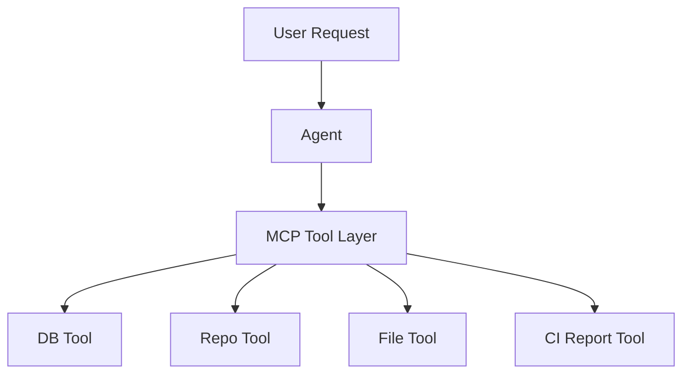
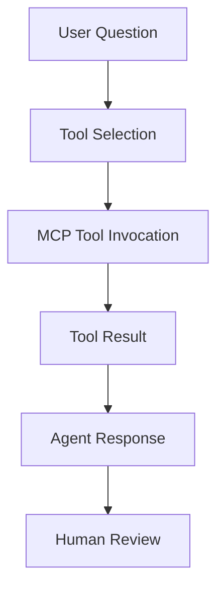

# Lab 07 - MCP and Enterprise Integrations

**Course:** Advanced Software Development with Agentic AI (ASD)  
**Theme:** Tool-Augmented Agents with MCP  
**Primary IDE:** VS Code  (Optional IDE: AWS Kiro).  
**AI Runtime:** Ollama  
**Primary Local Model (Open Source):** Qwen 2.5 0.5B  
**Secondary Local Review Model (Open Source):** Llama 3.1 8B  
**Duration:** 60 Minutes  

## 1. Overview

<details>
<summary>Goal</summary>

Extend the Student Enrolment System with a tool-augmented agent capability using MCP.

Students will add an MCP tool layer to the existing `enrolment-app-open-ai/` application folder.

The MCP layer allows the system to access external capabilities such as:

* database queries
* repository inspection
* local file access
* CI report reading
* integration evidence collection

This lab does not introduce RAG, multi-agent systems, deployment, or advanced reasoning agents.

</details>

<details>
<summary>Agentic Workflow</summary>

PLAN → ACT → OBSERVE → TOOL INVOCATION → REVIEW → HUMAN REVIEW → ADAPT

</details>

<details>
<summary>Expected Results</summary>

By the end of this lab, students should have:

* MCP server added to `enrolment-app-open-ai/`
* MCP tool definitions
* Database connectivity tool
* Repository inspection tool
* File access tool
* CI report reading tool
* Tool invocation evidence
* Tool boundary analysis
* MCP improvement cycle
* Evidence log

</details>

---

## 2. Prerequisites and Configuration

<details>
<summary>Prerequisites</summary>

To start this lab, students should have:

Complete:

* Lab 01
* Lab 02
* Lab 03
* Lab 04
* Lab 05

Required:

* Docker Desktop
* GitHub repository
* GitHub Actions evidence from Lab 05
* Ollama
* qwen2.5:0.5b
* llama3.1:8b
* Python virtual environment
* Existing `enrolment-app-open-ai/` application folder
* Lab 04 microservices structure inside `enrolment-app-open-ai/`
* Lab 05 workflow at repository root (`.github/workflows/lab5-ci.yml`)
* Lab 05 reports inside `enrolment-app-open-ai/reports/`
* Lab 05 CI evidence generated at least once (manual `workflow_dispatch` is valid)

DeepSeek-R1 is not required for this lab.

</details>

<details>
<summary>Environment Verification</summary>

Run these commands from the repository root.

```bash
docker --version
docker compose version
git --version
ollama list
python --version
```

Expected models:

```text
qwen2.5:0.5b
llama3.1:8b
```

</details>

<details>
<summary>Agent Configuration</summary>

```env
OLLAMA_BASE_URL=http://localhost:11434/v1
OLLAMA_MODEL=qwen2.5:0.5b
OLLAMA_REVIEW_MODEL=llama3.1:8b
```

Agent roles:

| Agent     | Role                 | Purpose                                                |
| --------- | -------------------- | ------------------------------------------------------ |
| Qwen 2.5  | Implementation Agent | Generate MCP scaffold, tool definitions, and evidence |
| Llama 3.1 | Review Agent         | Review tool boundaries, risks, and validation evidence |

</details>

---

## 3. Scenario Setup

<details>
<summary>Student Enrolment System</summary>

The Student Enrolment System exists in one application folder:

```text
enrolment-app-open-ai/
```

By the end of Lab 05, the application contains:

* frontend-service
* enrolment-service
* database-service
* Docker Compose configuration
* GitHub Actions CI workflow (`.github/workflows/lab5-ci.yml`)
* CI evidence reports

The system can already:

* display students
* search students
* separate frontend, backend, and database responsibilities
* build and validate through CI

The next requirement is to allow an agent to use external tools safely.

</details>

<details>
<summary>Business Requirement</summary>

The business now requires an agent that can answer operational and project questions by using tools.

Examples:

* How many students are enrolled?
* Which students are enrolled in ASD101?
* What project files exist?
* What CI evidence exists?
* What tool was used to retrieve this information?

The agent must not guess these answers.

The agent must use tools and produce evidence.

</details>

<details>
<summary>MCP Architecture</summary>



</details>

<details>
<summary>Tool Flow</summary>



</details>

<details>
<summary>Project Structure</summary>

Lab 07 updates the existing application folder.

Lab 05 workflow remains at repository root:

```text
agentic-ai-asd-2026/
└── .github/
    └── workflows/
        └── lab5-ci.yml
```

```text
enrolment-app-open-ai/
│
├── docker-compose.yml
│
├── frontend-service/
│   ├── Dockerfile
│   ├── templates/
│   │   ├── index.html
│   │   └── tabs/
│   │       ├── normal.html
│   │       ├── ai-mode.html
│   │       └── mcp.html
│   └── css/
│       └── styles.css
│
├── enrolment-service/
│   ├── app.py
│   ├── requirements.txt
│   ├── Dockerfile
│   └── prompts/
│
├── database-service/
│   ├── init_db.py
│   ├── Dockerfile
│   └── data/
│       └── enrolment.db
│
├── mcp-server/
│   ├── server.py
│   ├── tools.py
│   └── requirements.txt
│
├── prompts/
│   ├── tool_selection_prompt.txt
│   ├── tool_review_prompt.txt
│   └── integration_review_prompt.txt
│
└── reports/
    ├── report.json
    ├── report.md
    ├── run-view.md
    ├── tool-review.md
    ├── boundary-analysis.md
    ├── integration-report.md
    └── run-report.md
```

</details>

<details>
<summary>Create Project Workspace</summary>

Run these commands from the repository root.

**Linux / macOS**

```bash
mkdir -p enrolment-app-open-ai/mcp-server
mkdir -p enrolment-app-open-ai/prompts
mkdir -p enrolment-app-open-ai/reports
mkdir -p enrolment-app-open-ai/frontend-service/templates/tabs

touch enrolment-app-open-ai/mcp-server/server.py
touch enrolment-app-open-ai/mcp-server/tools.py
touch enrolment-app-open-ai/mcp-server/requirements.txt

touch enrolment-app-open-ai/frontend-service/templates/index.html
touch enrolment-app-open-ai/frontend-service/templates/tabs/normal.html
touch enrolment-app-open-ai/frontend-service/templates/tabs/ai-mode.html
touch enrolment-app-open-ai/frontend-service/templates/tabs/mcp.html
touch enrolment-app-open-ai/frontend-service/css/styles.css

touch enrolment-app-open-ai/prompts/tool_selection_prompt.txt
touch enrolment-app-open-ai/prompts/tool_review_prompt.txt
touch enrolment-app-open-ai/prompts/integration_review_prompt.txt

touch enrolment-app-open-ai/reports/tool-review.md
touch enrolment-app-open-ai/reports/boundary-analysis.md
touch enrolment-app-open-ai/reports/integration-report.md
touch enrolment-app-open-ai/reports/run-report.md
```

**Windows PowerShell**

```powershell
mkdir enrolment-app-open-ai\mcp-server
mkdir enrolment-app-open-ai\prompts
mkdir enrolment-app-open-ai\reports
mkdir enrolment-app-open-ai\frontend-service\templates\tabs

New-Item enrolment-app-open-ai\mcp-server\server.py -ItemType File
New-Item enrolment-app-open-ai\mcp-server\tools.py -ItemType File
New-Item enrolment-app-open-ai\mcp-server\requirements.txt -ItemType File

New-Item enrolment-app-open-ai\frontend-service\templates\index.html -ItemType File
New-Item enrolment-app-open-ai\frontend-service\templates\tabs\normal.html -ItemType File
New-Item enrolment-app-open-ai\frontend-service\templates\tabs\ai-mode.html -ItemType File
New-Item enrolment-app-open-ai\frontend-service\templates\tabs\mcp.html -ItemType File
New-Item enrolment-app-open-ai\frontend-service\css\styles.css -ItemType File

New-Item enrolment-app-open-ai\prompts\tool_selection_prompt.txt -ItemType File
New-Item enrolment-app-open-ai\prompts\tool_review_prompt.txt -ItemType File
New-Item enrolment-app-open-ai\prompts\integration_review_prompt.txt -ItemType File

New-Item enrolment-app-open-ai\reports\tool-review.md -ItemType File
New-Item enrolment-app-open-ai\reports\boundary-analysis.md -ItemType File
New-Item enrolment-app-open-ai\reports\integration-report.md -ItemType File
New-Item enrolment-app-open-ai\reports\run-report.md -ItemType File
```

</details>

<details>
<summary>Verify Existing Lab 04 and Lab 05 Artifacts</summary>

Before adding MCP, verify that the application already contains the Lab 04 and Lab 05 artifacts.

**Linux / macOS**

```bash
ls enrolment-app-open-ai
ls .github/workflows
ls enrolment-app-open-ai/reports
ls enrolment-app-open-ai/database-service
```

**Windows PowerShell**

```powershell
Get-ChildItem enrolment-app-open-ai
Get-ChildItem .github\workflows
Get-ChildItem enrolment-app-open-ai\reports
Get-ChildItem enrolment-app-open-ai\database-service
```

Success Criteria:

```text
docker-compose.yml exists
frontend-service exists
enrolment-service exists
database-service exists
.github/workflows/lab5-ci.yml exists (repository root)
reports/report.json exists (or run Lab 05 `workflow_dispatch` to generate it)
database-service/data/enrolment.db exists
```

</details>

<details>
<summary>MCP Prompt Assets</summary>

MCP prompt assets for Lab 07 are stored in:

```text
enrolment-app-open-ai/prompts/
```

```text
prompts/
├── tool_selection_prompt.txt
├── tool_review_prompt.txt
└── integration_review_prompt.txt
```

<details>
<summary>tool_selection_prompt.txt</summary>

```text
Select the most appropriate MCP tool for the user request.

Available tools:

- student_count
- students_by_subject
- project_files
- ci_report

Return:

Selected Tool:
Reason:
Expected Evidence:
```

</details>

<details>
<summary>tool_review_prompt.txt</summary>

```text
Review the MCP tool definition.

Evaluate:

- tool purpose
- input requirements
- output format
- responsibility boundary
- risk of misuse
- evidence produced

Return exactly:

Risk:
Correction:
Retest:
```

</details>

<details>
<summary>integration_review_prompt.txt</summary>

```text
Review the MCP integration evidence.

Validate:

- tool invoked
- result returned
- evidence captured
- no unsupported claim made
- human decision recorded

Return:

Strengths:
Risks:
Recommendations:
```

</details>

</details>

---

## 4. MCP Server Setup and Development

<details>
<summary>MCP Fundamentals</summary>

MCP separates reasoning from external actions.

Rules for this lab:

* The model does not access DB/files/repo directly.
* All external access is through MCP tools.
* Tool output is the evidence source.

Execution boundary:

```text
Model -> selects tool and explains result
Tool -> retrieves data/action output
Evidence -> tool output recorded for review
```

</details>

<details>
<summary>MCP Technology Decision</summary>

Use the MCP Python SDK with FastMCP.

Stack:

```text
Python
MCP Python SDK
FastMCP
```

Installation:

```bash
pip install mcp
```

</details>

<details>
<summary>MCP Server Purpose</summary>

The MCP server exposes controlled tools for the Student Enrolment System.

Required tools:

* student_count
* students_by_subject
* project_files
* ci_report

Each tool must define purpose, input, output, and failure behavior.

</details>

<details>
<summary>mcp-server/requirements.txt</summary>

```text
mcp
```

</details>

<details>
<summary>mcp-server/tools.py</summary>

```python
import json
import sqlite3
from pathlib import Path

BASE_DIR = Path(__file__).resolve().parent
APP_DIR = BASE_DIR.parent
DATABASE_PATH = APP_DIR / "database-service" / "data" / "enrolment.db"


def _connect_db():
    if not DATABASE_PATH.exists():
        raise FileNotFoundError(f"Database not found: {DATABASE_PATH}")
    conn = sqlite3.connect(DATABASE_PATH)
    conn.row_factory = sqlite3.Row
    return conn


def get_student_count():
    conn = _connect_db()
    try:
        cursor = conn.cursor()
        cursor.execute("SELECT COUNT(*) AS student_count FROM students")
        row = cursor.fetchone()
        return {"student_count": row[0] if row else 0}
    finally:
        conn.close()


def get_students_by_subject(subject_code: str):
    subject = (subject_code or "").strip().upper()
    if not subject:
        return {"error": "subject_code is required"}

    conn = _connect_db()
    try:
        cursor = conn.cursor()
        cursor.execute(
            """
            SELECT student_id, student_name, subject_code
            FROM students
            WHERE subject_code = ?
            ORDER BY student_id
            """,
            (subject,),
        )
        return [dict(row) for row in cursor.fetchall()]
    finally:
        conn.close()


def list_project_files(directory_path: str = ".."):  # relative to mcp-server/
    path = (BASE_DIR / directory_path).resolve()
    if not path.exists() or not path.is_dir():
        return {"error": f"Directory not found: {path}"}

    return sorted(item.name for item in path.iterdir())


def read_ci_report(report_path: str = "../reports/report.json"):
    report_file = (BASE_DIR / report_path).resolve()
    if not report_file.exists():
        return {
            "error": "Report not found",
            "path": str(report_file),
            "hint": "Run Lab 05 workflow_dispatch to generate report.json",
        }

    with report_file.open("r", encoding="utf-8") as file:
        return json.load(file)


if __name__ == "__main__":
    print(get_student_count())
    print(get_students_by_subject("ASD101"))
    print(list_project_files(".."))
    print(read_ci_report("../reports/report.json"))
```

</details>

<details>
<summary>mcp-server/server.py</summary>

```python
from mcp.server.fastmcp import FastMCP

from tools import (
    get_student_count,
    get_students_by_subject,
    list_project_files,
    read_ci_report
)


mcp = FastMCP(
    "Student Enrolment MCP"
)
AVAILABLE_TOOLS = [
    "student_count",
    "students_by_subject",
    "project_files",
    "ci_report",
]


@mcp.tool()
def student_count():
    return get_student_count()


@mcp.tool()
def students_by_subject(
    subject_code: str
):
    return get_students_by_subject(subject_code)


@mcp.tool()
def project_files(
    directory_path: str = ".."
):
    return list_project_files(directory_path)


@mcp.tool()
def ci_report(
    report_path: str = "../reports/report.json"
):
    return read_ci_report(report_path)


if __name__ == "__main__":
    print("Starting Student Enrolment MCP Server...")
    print("Server status: RUNNING")
    print("Interact with MCP tools from a second terminal.")
    print("Available tools:")
    for tool in AVAILABLE_TOOLS:
        print(f"- {tool}")
    mcp.run()
```

</details>

<details>
<summary>Tool Definitions</summary>

| MCP Tool | Purpose | Input | Output |
|---|---|---|---|
| student_count | Return total students from SQLite | None | `{ "student_count": number }` |
| students_by_subject | Return students by subject code | `subject_code` | `[{ student_id, student_name, subject_code }]` or error |
| project_files | List files/folders in a directory | `directory_path` | `[name, ...]` or error |
| ci_report | Read Lab 05 report JSON | `report_path` | report JSON or error with hint |

</details>

<details>
<summary>Tool Validation Commands</summary>

1. Install dependencies.

```bash
cd enrolment-app-open-ai/mcp-server

pip install -r requirements.txt
```

2. Run direct tool checks.

```bash
python tools.py
```

Expected:

```text
Student count is returned.
ASD101 student records are returned.
Application files are listed.
CI report data is returned (or a clear missing-report error with hint).
```

3. Start MCP server.

```bash
python server.py
```

Expected:

```text
Starting Student Enrolment MCP Server...
Server status: RUNNING
Interact with MCP tools from a second terminal.
Available tools:
- student_count
- students_by_subject
- project_files
- ci_report
```

</details>

<details>
<summary>Tabbed Frontend UI Integration (HTMX + JS)</summary>

Lab 07 keeps one frontend entry page but organizes features using tabs.

Frontend files to update:

```text
enrolment-app-open-ai/frontend-service/templates/index.html
enrolment-app-open-ai/frontend-service/templates/tabs/normal.html
enrolment-app-open-ai/frontend-service/templates/tabs/ai-mode.html
enrolment-app-open-ai/frontend-service/templates/tabs/mcp.html
enrolment-app-open-ai/frontend-service/css/styles.css
enrolment-app-open-ai/frontend-service/Dockerfile
```

This keeps the application as one frontend app while reducing UI crowding.

### `frontend-service/templates/index.html`

```html
<!DOCTYPE html>
<html>
<head>
    <title>Student Enrolment App</title>
    <link rel="stylesheet" href="css/styles.css">
</head>
<body>
<main class="app-shell">
    <header class="app-header">
        <h1>Student Enrolment App</h1>
        <p>HTMX UI: Normal UI, AI Mode, MCP, RAG, Multi-Agent</p>
    </header>

    <section class="tab-shell card">
        <nav class="tab-nav" aria-label="Application tabs">
            <button class="tab-btn is-active" data-tab="normal" type="button">Normal UI</button>
            <button class="tab-btn" data-tab="ai-mode" type="button">AI Mode</button>
            <button class="tab-btn" data-tab="mcp" type="button">MCP</button>
            <button class="tab-btn" data-tab="rag" type="button" disabled title="Added in Lab 8">RAG (Lab 8)</button>
            <button class="tab-btn" data-tab="multi-agent" type="button" disabled title="Added in Lab 10">Multi-Agent (Lab 10)</button>
        </nav>

        <div class="tab-content">
            <iframe id="tab-frame-normal" class="tab-frame is-active" src="tabs/normal.html" title="Normal UI tab"></iframe>
            <iframe id="tab-frame-ai-mode" class="tab-frame" src="tabs/ai-mode.html" title="AI Mode tab"></iframe>
            <iframe id="tab-frame-mcp" class="tab-frame" src="tabs/mcp.html" title="MCP tab"></iframe>
        </div>
    </section>
</main>

<script>
const tabButtons = Array.from(document.querySelectorAll(".tab-btn"));
const tabFrames = {
    normal: document.getElementById("tab-frame-normal"),
    "ai-mode": document.getElementById("tab-frame-ai-mode"),
    mcp: document.getElementById("tab-frame-mcp"),
};

function activateTab(tabName) {
    tabButtons.forEach((button) => {
        button.classList.toggle("is-active", button.dataset.tab === tabName);
    });

    Object.entries(tabFrames).forEach(([name, frame]) => {
        frame.classList.toggle("is-active", name === tabName);
    });

    window.location.hash = tabName;
}

tabButtons.forEach((button) => {
    if (button.disabled) {
        return;
    }

    button.addEventListener("click", () => {
        activateTab(button.dataset.tab);
    });
});

const hashTab = window.location.hash.replace("#", "");
if (hashTab && tabFrames[hashTab]) {
    activateTab(hashTab);
} else {
    activateTab("normal");
}
</script>

</body>
</html>
```

### `frontend-service/templates/tabs/normal.html`

```html
<!DOCTYPE html>
<html>
<head>
    <meta charset="utf-8">
    <title>Normal UI</title>
    <link rel="stylesheet" href="/css/styles.css">
    <style>
        body { margin: 0; min-height: auto; background: transparent; }
        .app-shell { max-width: none; padding: 0; }
    </style>
</head>
<body>
<main class="app-shell">
    <section class="card">
        <h2>Students</h2>

        <button id="toggle-students-btn" type="button">
            Show All Students
        </button>

        <div id="students-result" class="panel is-hidden"></div>

        <h2>Find Student by ID</h2>

        <form id="student-by-id-form">
            <label for="student_id">Student ID</label>
            <input id="student_id" name="student_id" type="number" min="1" placeholder="Enter student ID">
            <button type="submit">Get Student</button>
        </form>

        <div id="student-result" class="panel"></div>

        <h2>Find Students by Subject Code</h2>

        <form id="students-by-subject-form">
            <label for="subject_code">Subject Code</label>
            <input id="subject_code" name="subject_code" type="text" placeholder="Example: ASD101">
            <button type="submit">Find Students</button>
        </form>

        <div id="subject-result" class="panel"></div>
    </section>
</main>

<script>
const toggleStudentsBtn = document.getElementById("toggle-students-btn");
const studentsPanel = document.getElementById("students-result");
const studentByIdForm = document.getElementById("student-by-id-form");
const studentsBySubjectForm = document.getElementById("students-by-subject-form");

async function renderIntoPanel(panelId, url, options = {}) {
    const panel = document.getElementById(panelId);

    try {
        const response = await fetch(url, options);
        const body = await response.text();
        panel.innerHTML = body;
    } catch (error) {
        panel.innerHTML = `<p>Request failed.</p><pre>${error}</pre>`;
    }
}

toggleStudentsBtn.addEventListener("click", () => {
    const isHidden = studentsPanel.classList.contains("is-hidden");

    if (isHidden) {
        studentsPanel.classList.remove("is-hidden");
        toggleStudentsBtn.textContent = "Hide All Students";

        if (!studentsPanel.dataset.loaded) {
            renderIntoPanel("students-result", "http://localhost:5001/students");
            studentsPanel.dataset.loaded = "true";
        }
    } else {
        studentsPanel.classList.add("is-hidden");
        toggleStudentsBtn.textContent = "Show All Students";
    }
});

studentByIdForm.addEventListener("submit", (event) => {
    event.preventDefault();
    const formData = new FormData(studentByIdForm);
    const query = new URLSearchParams(formData).toString();
    renderIntoPanel("student-result", `http://localhost:5001/students/by-id?${query}`);
});

studentsBySubjectForm.addEventListener("submit", (event) => {
    event.preventDefault();
    const formData = new FormData(studentsBySubjectForm);
    const query = new URLSearchParams(formData).toString();
    renderIntoPanel("subject-result", `http://localhost:5001/students/by-subject?${query}`);
});
</script>
</body>
</html>
```

### `frontend-service/templates/tabs/ai-mode.html`

```html
<!DOCTYPE html>
<html>
<head>
    <meta charset="utf-8">
    <title>AI Mode</title>
    <link rel="stylesheet" href="/css/styles.css">
    <style>
        body { margin: 0; min-height: auto; background: transparent; }
        .app-shell { max-width: none; padding: 0; }
    </style>
</head>
<body>
<main class="app-shell">
    <section class="card">
        <h2>Ask Local AI Agent</h2>

        <form id="ask-form">
            <label for="question">Question</label>
            <textarea id="question" name="question" rows="5">Explain what this Student Enrolment App does in one short paragraph.</textarea>
            <button type="submit">Ask Local Agent</button>
        </form>

        <div id="agent-result" class="panel"></div>

        <h2>Ask With Context</h2>

        <form id="ask-with-context-form">
            <label for="context-question">Question</label>
            <textarea id="context-question" name="question" rows="4">Explain the Student Enrolment App.</textarea>
            <button type="submit">Ask With Context</button>
        </form>

        <div id="context-result" class="panel"></div>

        <h2>Architecture Review</h2>

        <form id="architecture-review-form">
            <label for="architecture_request">Request</label>
            <textarea id="architecture_request" name="architecture_request" rows="4">Review service boundaries for frontend-service, enrolment-service, and database-service.</textarea>
            <button type="submit">Run Architecture Review</button>
        </form>

        <div id="architecture-result" class="panel"></div>
    </section>
</main>

<script>
const askForm = document.getElementById("ask-form");
const askWithContextForm = document.getElementById("ask-with-context-form");
const architectureReviewForm = document.getElementById("architecture-review-form");

async function renderIntoPanel(panelId, url, options = {}) {
    const panel = document.getElementById(panelId);

    try {
        const response = await fetch(url, options);
        const body = await response.text();
        panel.innerHTML = body;
    } catch (error) {
        panel.innerHTML = `<p>Request failed.</p><pre>${error}</pre>`;
    }
}

askForm.addEventListener("submit", (event) => {
    event.preventDefault();
    const formData = new URLSearchParams(new FormData(askForm));
    renderIntoPanel("agent-result", "http://localhost:5001/ask", {
        method: "POST",
        headers: { "Content-Type": "application/x-www-form-urlencoded" },
        body: formData,
    });
});

askWithContextForm.addEventListener("submit", (event) => {
    event.preventDefault();
    const formData = new URLSearchParams(new FormData(askWithContextForm));
    renderIntoPanel("context-result", "http://localhost:5001/ask-with-context", {
        method: "POST",
        headers: { "Content-Type": "application/x-www-form-urlencoded" },
        body: formData,
    });
});

architectureReviewForm.addEventListener("submit", (event) => {
    event.preventDefault();
    const formData = new URLSearchParams(new FormData(architectureReviewForm));
    renderIntoPanel("architecture-result", "http://localhost:5001/architecture-review", {
        method: "POST",
        headers: { "Content-Type": "application/x-www-form-urlencoded" },
        body: formData,
    });
});
</script>
</body>
</html>
```

### `frontend-service/templates/tabs/mcp.html`

```html
<!DOCTYPE html>
<html>
<head>
    <meta charset="utf-8">
    <title>MCP</title>
    <link rel="stylesheet" href="/css/styles.css">
    <script src="https://unpkg.com/htmx.org@1.9.12"></script>
    <style>
        body { margin: 0; min-height: auto; background: transparent; }
        .app-shell { max-width: none; padding: 0; }
    </style>
</head>
<body>
<main class="app-shell">
    <section class="card">
        <h2>MCP Mode</h2>

        <div class="feature-toggle-row">
            <label class="toggle-switch" for="mcp-mode-toggle">
                <input id="mcp-mode-toggle" type="checkbox" checked>
                <span class="toggle-label">MCP Enabled</span>
            </label>
            <span id="mcp-mode-state" class="feature-state feature-on">ON</span>
        </div>

        <h2>MCP Tools</h2>

        <div class="feature-actions">
            <button
                type="button"
                class="mcp-action"
                hx-post="http://localhost:5001/mcp/student-count"
                hx-target="#mcp-result"
                hx-swap="innerHTML"
            >Get Student Count</button>
        </div>

        <form
            id="mcp-subject-form"
            class="feature-form"
            hx-post="http://localhost:5001/mcp/students-by-subject"
            hx-target="#mcp-result"
            hx-swap="innerHTML"
        >
            <label for="mcp_subject_code">MCP: Students by Subject</label>
            <input id="mcp_subject_code" name="subject_code" type="text" placeholder="Example: ASD101">
            <button type="submit" class="mcp-action">Run Tool</button>
        </form>

        <form
            id="mcp-project-form"
            class="feature-form"
            hx-post="http://localhost:5001/mcp/project-files"
            hx-target="#mcp-result"
            hx-swap="innerHTML"
        >
            <label for="mcp_directory_path">MCP: Project Files</label>
            <input id="mcp_directory_path" name="directory_path" type="text" value="..">
            <button type="submit" class="mcp-action">Run Tool</button>
        </form>

        <div id="mcp-result" class="panel panel-mcp">MCP tool responses will appear here.</div>
    </section>
</main>

<script>
const mcpModeToggle = document.getElementById("mcp-mode-toggle");
const mcpModeState = document.getElementById("mcp-mode-state");
const mcpResultPanel = document.getElementById("mcp-result");

const MCP_STORAGE_KEY = "mcp_mode_enabled";

function isMcpEnabled() {
    return mcpModeToggle.checked;
}

function renderMcpState() {
    if (isMcpEnabled()) {
        mcpModeState.textContent = "ON";
        mcpModeState.classList.add("feature-on");
        mcpModeState.classList.remove("feature-off");
    } else {
        mcpModeState.textContent = "OFF";
        mcpModeState.classList.add("feature-off");
        mcpModeState.classList.remove("feature-on");
    }
}

function renderMcpDisabledMessage() {
    mcpResultPanel.innerHTML = "<p>MCP Mode is OFF. Enable MCP Mode to run MCP tools.</p>";
}

function saveMcpMode() {
    localStorage.setItem(MCP_STORAGE_KEY, String(isMcpEnabled()));
}

function loadMcpMode() {
    const persisted = localStorage.getItem(MCP_STORAGE_KEY);
    if (persisted === null) {
        mcpModeToggle.checked = true;
    } else {
        mcpModeToggle.checked = persisted === "true";
    }
    renderMcpState();
}

mcpModeToggle.addEventListener("change", () => {
    saveMcpMode();
    renderMcpState();

    if (!isMcpEnabled()) {
        renderMcpDisabledMessage();
    }
});

document.body.addEventListener("htmx:configRequest", (event) => {
    const trigger = event.detail.elt;
    if (trigger && trigger.classList.contains("mcp-action")) {
        event.detail.headers["X-MCP-Mode"] = isMcpEnabled() ? "on" : "off";
    }
});

document.body.addEventListener("htmx:beforeRequest", (event) => {
    const trigger = event.detail.elt;
    if (!trigger || !trigger.classList.contains("mcp-action")) {
        return;
    }

    if (!isMcpEnabled()) {
        event.preventDefault();
        renderMcpDisabledMessage();
    }
});

loadMcpMode();
if (!isMcpEnabled()) {
    renderMcpDisabledMessage();
}
</script>
</body>
</html>
```

### `frontend-service/css/styles.css`

```css
:root {
    --bg-0: #0b1020;
    --bg-1: #111a31;
    --bg-2: #1a2645;
    --surface: #0f172b;
    --surface-alt: #15213d;
    --text: #e8edf8;
    --muted: #9eb0d3;
    --accent: #45c9ff;
    --accent-strong: #1eb1ee;
    --border: #2b3a63;
    --radius: 12px;
    --state-on-bg: #0f6a45;
    --state-on-fg: #d7ffee;
    --state-off-bg: #6a2031;
    --state-off-fg: #ffe2e8;
}

* {
    box-sizing: border-box;
}

body {
    margin: 0;
    min-height: 100vh;
    font-family: "Segoe UI", Tahoma, Geneva, Verdana, sans-serif;
    line-height: 1.5;
    color: var(--text);
    background:
        radial-gradient(1100px 540px at 10% -10%, #1e3263 0%, transparent 60%),
        radial-gradient(900px 480px at 100% 0%, #1a4e74 0%, transparent 58%),
        linear-gradient(160deg, var(--bg-0) 0%, var(--bg-1) 46%, var(--bg-2) 100%);
}

.app-shell {
    max-width: 1200px;
    margin: 0 auto;
    padding: 1.25rem;
}

.app-header {
    margin-bottom: 1rem;
}

.app-header h1 {
    margin: 0;
    font-size: 1.9rem;
}

.app-header p {
    margin: 0.4rem 0 0;
    color: var(--muted);
}

.layout-grid {
    display: block;
}

.card {
    background: linear-gradient(180deg, rgba(20, 31, 56, 0.95), rgba(13, 22, 41, 0.95));
    border: 1px solid var(--border);
    border-radius: var(--radius);
    padding: 1rem;
    box-shadow: 0 18px 40px rgba(0, 0, 0, 0.35);
}

h2 {
    margin: 0 0 0.6rem;
    font-size: 1.1rem;
}

label {
    display: block;
    margin-bottom: 0.3rem;
    color: var(--muted);
}

button {
    margin-top: 0.5rem;
    padding: 0.5rem 0.9rem;
    border: 1px solid transparent;
    border-radius: 10px;
    font-weight: 600;
    color: #06202c;
    background: var(--accent);
    cursor: pointer;
}

button:hover {
    background: var(--accent-strong);
}

input,
textarea {
    width: 100%;
    padding: 0.55rem 0.7rem;
    border: 1px solid var(--border);
    border-radius: 10px;
    color: var(--text);
    background: var(--surface-alt);
}

.panel {
    margin-top: 0.7rem;
    padding: 0.75rem;
    border: 1px solid var(--border);
    border-radius: 10px;
    background: var(--surface);
    min-height: 2.5rem;
}

.panel-mcp {
    border-color: #2d5b7b;
}

.feature-toggle-row {
    display: flex;
    align-items: center;
    justify-content: space-between;
    gap: 0.75rem;
    margin-bottom: 0.9rem;
    padding: 0.65rem 0.75rem;
    border: 1px solid var(--border);
    border-radius: 10px;
    background: rgba(15, 23, 43, 0.65);
}

.toggle-switch {
    display: inline-flex;
    align-items: center;
    gap: 0.55rem;
    margin: 0;
    color: var(--text);
}

.toggle-switch input {
    width: auto;
    margin: 0;
}

.toggle-label {
    font-weight: 600;
    color: var(--text);
}

.feature-state {
    display: inline-flex;
    align-items: center;
    justify-content: center;
    min-width: 3.4rem;
    padding: 0.2rem 0.55rem;
    border-radius: 999px;
    font-size: 0.78rem;
    font-weight: 700;
    letter-spacing: 0.04em;
}

.feature-on {
    background: var(--state-on-bg);
    color: var(--state-on-fg);
}

.feature-off {
    background: var(--state-off-bg);
    color: var(--state-off-fg);
}

.feature-actions,
.feature-form {
    margin-bottom: 0.7rem;
}

.tab-shell {
    padding: 0.8rem;
}

.tab-nav {
    display: flex;
    flex-wrap: wrap;
    gap: 0.5rem;
    margin-bottom: 0.8rem;
}

.tab-btn {
    margin-top: 0;
    color: var(--text);
    background: #1a2b4f;
    border: 1px solid var(--border);
}

.tab-btn:hover {
    background: #223766;
}

.tab-btn.is-active {
    color: #06202c;
    background: var(--accent);
    border-color: transparent;
}

.tab-btn:disabled {
    opacity: 0.55;
    cursor: not-allowed;
}

.tab-content {
    position: relative;
}

.tab-frame {
    width: 100%;
    min-height: 720px;
    border: 0;
    display: none;
    background: transparent;
}

.tab-frame.is-active {
    display: block;
}

.is-hidden {
    display: none;
}

@media (max-width: 900px) {
    .tab-frame {
        min-height: 840px;
    }
}
```

### `frontend-service/Dockerfile`

```dockerfile
FROM nginx:alpine

COPY templates/ /usr/share/nginx/html/
COPY css/ /usr/share/nginx/html/css/

EXPOSE 80
```

</details>

<details>
<summary>MCP Backend Integration for Tabbed UI</summary>

### `enrolment-service/app.py`

```python
from flask import Flask, request
from flask_cors import CORS
from openai import OpenAI
from pathlib import Path

import json
import os
import requests

app = Flask(__name__)
CORS(app)

DATABASE_SERVICE_URL = os.getenv("DATABASE_SERVICE_URL", "http://database-service:5002")
OLLAMA_BASE_URL = os.getenv("OLLAMA_BASE_URL", "http://host.docker.internal:11434/v1")
OLLAMA_MODEL = os.getenv("OLLAMA_MODEL", "qwen2.5:0.5b")
PROMPT_DIR = Path("prompts")

# MCP toggle for Lab 07 advanced mode.
MCP_ENABLED = os.getenv("MCP_ENABLED", "true").strip().lower() in ("1", "true", "yes", "on")

BASE_DIR = Path(__file__).resolve().parent
APP_DIR = BASE_DIR.parent

client = OpenAI(base_url=OLLAMA_BASE_URL, api_key="ollama")


def load_prompt(filename):
    return (PROMPT_DIR / filename).read_text(encoding="utf-8").strip()


def format_students_html(students):
    if not students:
        return "<p>No students found.</p>"

    html = "<ul>"
    for student in students:
        html += (
            f"<li>{student['student_id']} - "
            f"{student['student_name']} - {student['subject_code']}</li>"
        )
    html += "</ul>"
    return html


def format_student_html(student):
    return (
        f"<p>ID: {student['student_id']}<br>"
        f"Name: {student['student_name']}<br>"
        f"Subject: {student['subject_code']}</p>"
    )


def call_architecture_agent(system_prompt_file, task_prompt_file, user_input, max_tokens=300):
    system_prompt = load_prompt(system_prompt_file)
    task_prompt = load_prompt(task_prompt_file)

    final_prompt = f"""
{task_prompt}

User Input:

{user_input}
"""

    response = client.chat.completions.create(
        model=OLLAMA_MODEL,
        messages=[
            {"role": "system", "content": system_prompt},
            {"role": "user", "content": final_prompt},
        ],
        max_tokens=max_tokens,
        temperature=0.2,
    )

    return response.choices[0].message.content.strip()


def mcp_mode_is_enabled(req) -> bool:
    if not MCP_ENABLED:
        return False

    # UI can send X-MCP-Mode: on/off. Backend remains source of truth.
    mode_header = req.headers.get("X-MCP-Mode", "on").strip().lower()
    return mode_header in ("1", "true", "yes", "on")


def mcp_disabled_response():
    return "<p>MCP Mode is disabled.</p>", 403


def mcp_render_json(title: str, payload):
    return (
        f"<h3>{title}</h3>"
        f"<pre>{json.dumps(payload, indent=2)}</pre>"
    )


@app.get("/")
def health():
    return "<p>enrolment-service running</p>", 200


@app.get("/students")
def get_students():
    try:
        response = requests.get(f"{DATABASE_SERVICE_URL}/students", timeout=5)
        response.raise_for_status()
        return format_students_html(response.json()), 200
    except requests.RequestException as exc:
        return (
            "<p>Failed to retrieve students from database-service.</p>"
            f"<pre>{exc}</pre>",
            503,
        )


@app.get("/students/by-id")
def get_student_by_id():
    student_id = request.args.get("student_id", "").strip()

    if not student_id:
        return "<p>Student ID is required.</p>", 400

    try:
        response = requests.get(f"{DATABASE_SERVICE_URL}/students/{student_id}", timeout=5)

        if response.status_code == 404:
            return "<p>Student not found.</p>", 404
        if response.status_code == 400:
            return "<p>Student ID must be valid.</p>", 400

        response.raise_for_status()
        return format_student_html(response.json()), 200
    except requests.RequestException as exc:
        return (
            "<p>Failed to retrieve student from database-service.</p>"
            f"<pre>{exc}</pre>",
            503,
        )


@app.get("/students/by-subject")
def get_students_by_subject():
    subject_code = request.args.get("subject_code", "").strip().upper()

    if not subject_code:
        return "<p>Subject code is required.</p>", 400

    try:
        response = requests.get(
            f"{DATABASE_SERVICE_URL}/students/by-subject",
            params={"subject_code": subject_code},
            timeout=5,
        )

        if response.status_code == 404:
            return f"<p>No students found for {subject_code}.</p>", 404

        response.raise_for_status()
        return format_students_html(response.json()), 200
    except requests.RequestException as exc:
        return (
            "<p>Failed to retrieve subject results from database-service.</p>"
            f"<pre>{exc}</pre>",
            503,
        )


@app.post("/ask")
def ask_local_agent():
    question = request.form.get("question", "").strip()

    if not question:
        return "<p>Question is required.</p>", 400

    try:
        response = client.chat.completions.create(
            model=OLLAMA_MODEL,
            messages=[
                {
                    "role": "system",
                    "content": (
                        "You are a concise software engineering assistant. "
                        "Answer in one short paragraph unless asked otherwise."
                    ),
                },
                {"role": "user", "content": question},
            ],
            max_tokens=200,
            temperature=0.2,
        )
        answer = response.choices[0].message.content
        return f"<p>{answer}</p>", 200
    except Exception as exc:
        return (
            "<p>Local AI agent request failed. "
            "Check that Ollama is running and that qwen2.5:0.5b is installed.</p>"
            f"<pre>{exc}</pre>",
            503,
        )


@app.post("/ask-with-context")
def ask_with_context():
    question = request.form.get("question", "").strip()

    if not question:
        return "<p>Question is required.</p>", 400

    try:
        system_prompt = load_prompt("system_prompt.txt")
        task_prompt = load_prompt("task_prompt.txt")
        context_prompt = load_prompt("context_prompt.txt")

        final_prompt = f"""
{task_prompt}

{context_prompt}

User Question:

{question}
"""

        response = client.chat.completions.create(
            model=OLLAMA_MODEL,
            messages=[
                {"role": "system", "content": system_prompt},
                {"role": "user", "content": final_prompt},
            ],
            max_tokens=300,
            temperature=0.2,
        )

        answer = response.choices[0].message.content
        return f"<p>{answer}</p>", 200
    except Exception as exc:
        return (
            "<p>Context-aware request failed.</p>"
            f"<pre>{exc}</pre>",
            503,
        )


@app.post("/architecture-review")
def architecture_review():
    architecture_request = request.form.get("architecture_request", "").strip()

    if not architecture_request:
        return "<p>Architecture request is required.</p>", 400

    try:
        answer = call_architecture_agent(
            "architecture_system_prompt.txt",
            "architecture_task_prompt.txt",
            architecture_request,
        )
        return f"<pre>{answer}</pre>", 200
    except Exception as exc:
        return (
            "<p>Architecture agent request failed.</p>"
            f"<pre>{exc}</pre>",
            503,
        )


@app.post("/mcp/student-count")
def mcp_student_count():
    if not mcp_mode_is_enabled(request):
        return mcp_disabled_response()

    try:
        response = requests.get(f"{DATABASE_SERVICE_URL}/students", timeout=5)
        response.raise_for_status()
        count = len(response.json())
        return mcp_render_json("MCP Tool: student_count", {"student_count": count}), 200
    except requests.RequestException as exc:
        return (
            "<p>MCP student_count failed.</p>"
            f"<pre>{exc}</pre>",
            503,
        )


@app.post("/mcp/students-by-subject")
def mcp_students_by_subject():
    if not mcp_mode_is_enabled(request):
        return mcp_disabled_response()

    subject_code = request.form.get("subject_code", "").strip().upper()
    if not subject_code:
        return "<p>subject_code is required.</p>", 400

    try:
        response = requests.get(
            f"{DATABASE_SERVICE_URL}/students/by-subject",
            params={"subject_code": subject_code},
            timeout=5,
        )

        if response.status_code == 404:
            return mcp_render_json("MCP Tool: students_by_subject", []), 200

        response.raise_for_status()
        return mcp_render_json("MCP Tool: students_by_subject", response.json()), 200
    except requests.RequestException as exc:
        return (
            "<p>MCP students_by_subject failed.</p>"
            f"<pre>{exc}</pre>",
            503,
        )


@app.post("/mcp/project-files")
def mcp_project_files():
    if not mcp_mode_is_enabled(request):
        return mcp_disabled_response()

    directory_path = request.form.get("directory_path", "..").strip()
    path = (APP_DIR / directory_path).resolve()

    if not path.exists() or not path.is_dir():
        return mcp_render_json(
            "MCP Tool: project_files",
            {"error": f"Directory not found: {path}"},
        ), 400

    items = sorted(item.name for item in path.iterdir())
    return mcp_render_json("MCP Tool: project_files", items), 200


@app.post("/mcp/ci-report")
def mcp_ci_report():
    if not mcp_mode_is_enabled(request):
        return mcp_disabled_response()

    report_path = request.form.get("report_path", "../reports/report.json").strip()
    report_file = (BASE_DIR / report_path).resolve()

    if not report_file.exists():
        return mcp_render_json(
            "MCP Tool: ci_report",
            {
                "error": "Report not found",
                "path": str(report_file),
                "hint": "Run Lab 05 workflow_dispatch to generate report.json",
            },
        ), 404

    try:
        with report_file.open("r", encoding="utf-8") as file:
            payload = json.load(file)
        return mcp_render_json("MCP Tool: ci_report", payload), 200
    except Exception as exc:
        return (
            "<p>MCP ci_report failed.</p>"
            f"<pre>{exc}</pre>",
            500,
        )


if __name__ == "__main__":
    app.run(host="0.0.0.0", port=5001, debug=True)
```

### `docker-compose.yml` update (enrolment-service env)

```yaml
enrolment-service:
  build:
    context: ./enrolment-service
  container_name: enrolment-service
  ports:
    - "5001:5001"
  environment:
    DATABASE_SERVICE_URL: http://database-service:5002
    OLLAMA_BASE_URL: http://host.docker.internal:11434/v1
    OLLAMA_MODEL: qwen2.5:0.5b
    MCP_ENABLED: "true"
  extra_hosts:
    - "host.docker.internal:host-gateway"
  depends_on:
    - database-service
  restart: unless-stopped
```

</details>

---

## 5. Agent and Tool Integration

<details>
<summary>Integration Overview</summary>

Use separate workflows for backend execution and frontend verification.

### Backend Terminals

Use two terminals for service-side MCP validation.

**Terminal A (MCP runtime):**

* Run `mcp-server/server.py`.
* Keep it running while tests are executed.

**Terminal B (tool checks):**

* Execute MCP tool validation commands.
* Capture outputs and evidence for reports.

### Frontend UI and Terminal

Use the browser with one terminal for HTTP checks.

* Open the tabbed UI at `http://localhost:8080`.
* Verify MCP panel behavior (Mode ON/OFF).
* Optionally run `curl` endpoint checks from a terminal while viewing UI updates.
</details>

<details>
<summary>Start Services for MCP UI + Backend Validation</summary>

Start all required services.

Run from the app folder that contains docker-compose.yml.

Linux/macOS/Git Bash (recommended copy/paste block):

```bash
cd "/.../agentic-ai-asd-2026/enrolment-app-open-ai"
ls docker-compose.yml
docker compose up --build -d
docker ps
```

Expected precheck:

```text
docker-compose.yml
```

Linux/macOS/Git Bash:

```bash
cd enrolment-app-open-ai
docker compose up --build -d
docker ps
```

Windows PowerShell:

```powershell
cd enrolment-app-open-ai
Get-ChildItem docker-compose.yml
docker compose up --build -d
docker ps
```

Windows PowerShell (relative path option):

```powershell
cd enrolment-app-open-ai
docker compose up --build -d
docker ps
```

Expected:

```text
frontend-service running on http://localhost:8080
enrolment-service running on http://localhost:5001
database-service running on http://localhost:5002
```

</details>

<details>
<summary>MCP Backend Endpoint Tests (copy/paste)</summary>

Run each MCP endpoint directly first.

Linux/macOS/Git Bash:

```bash
curl -sS -X POST http://localhost:5001/mcp/student-count
curl -sS -X POST http://localhost:5001/mcp/students-by-subject -d "subject_code=ASD101"
curl -sS -X POST http://localhost:5001/mcp/project-files -d "directory_path=.."
curl -sS -X POST http://localhost:5001/mcp/ci-report -d "report_path=../reports/report.json"
```

Windows PowerShell:

```powershell
curl.exe -sS -X POST http://localhost:5001/mcp/student-count
curl.exe -sS -X POST http://localhost:5001/mcp/students-by-subject -d "subject_code=ASD101"
curl.exe -sS -X POST http://localhost:5001/mcp/project-files -d "directory_path=.."
curl.exe -sS -X POST http://localhost:5001/mcp/ci-report -d "report_path=../reports/report.json"
```

Expected:

```text
Each endpoint returns HTML containing MCP tool title and JSON payload.
```

</details>

<details>
<summary>MCP Mode Toggle Tests (ON/OFF behavior)</summary>

1. Open UI: `http://localhost:8080`.
2. In the MCP section, switch MCP Mode to OFF.
3. Click any MCP action.

Expected:

```text
MCP Mode is OFF. Enable MCP Mode to run MCP tools.
```

Backend OFF simulation (header-level):

Linux/macOS/Git Bash:

```bash
curl -sS -X POST http://localhost:5001/mcp/student-count -H "X-MCP-Mode: off" -i
```

Windows PowerShell:

```powershell
curl.exe -sS -X POST http://localhost:5001/mcp/student-count -H "X-MCP-Mode: off" -i
```

Expected:

```text
HTTP 403 with message: MCP Mode is disabled.
```

</details>

<details>
<summary>Tabbed UI Evidence Capture</summary>

Capture these screenshots and paste references into:

```text
../reports/run-report.md
```

Required screenshots:

```text
MCP tab visible in the tab navigation
MCP Mode ON with successful tool response
MCP Mode OFF with blocked MCP action message
```

Acceptance criteria:

```text
Tabbed shell (`index.html`) loads `tabs/mcp.html` successfully.
MCP actions run from the MCP tab.
MCP OFF prevents MCP tool execution.
```

</details>

<details>
<summary>Tool Discovery</summary>

Validate that the server starts and tool functions are callable.

1. In Terminal A, start the MCP server.

```bash
cd enrolment-app-open-ai/mcp-server

python server.py
```

Expected:

```text
Starting Student Enrolment MCP Server...
Server status: RUNNING
Interact with MCP tools from a second terminal.
Available tools:
- student_count
- students_by_subject
- project_files
- ci_report
```

2. In Terminal B, run direct function checks:

```bash
cd enrolment-app-open-ai/mcp-server

python -c "from tools import get_student_count, get_students_by_subject, list_project_files, read_ci_report; print(get_student_count()); print(get_students_by_subject('ASD101')); print(list_project_files('..')); print(read_ci_report('../reports/report.json'))"
```

Expected:

```text
Each tool returns structured output or a structured error.
```

Record evidence in:

```text
../reports/run-report.md
```

3. After all checks are complete, stop Terminal A with `Ctrl+C`.

Expected: `KeyboardInterrupt` / exit code `130` on stop is normal.

</details>

<details>
<summary>Database Connectivity Tool</summary>

Tool: `student_count`

Run in Terminal B:

```bash
cd enrolment-app-open-ai/mcp-server
python -c "from tools import get_student_count; print(get_student_count())"
```

Expected:

```text
{ "student_count": <number> }
```

Record evidence in:

```text
../reports/run-report.md
```

</details>

<details>
<summary>Subject Query Tool</summary>

Tool: `students_by_subject`

Run in Terminal B:

```bash
cd enrolment-app-open-ai/mcp-server
python -c "from tools import get_students_by_subject; print(get_students_by_subject('ASD101'))"
```

Expected:

```text
List of student rows for ASD101.
```

Record evidence in:

```text
../reports/run-report.md
```

</details>

<details>
<summary>Repository Integration Tool</summary>

Tool: `project_files`

Run in Terminal B:

```bash
cd enrolment-app-open-ai/mcp-server
python -c "from tools import list_project_files; print(list_project_files('..'))"
```

Expected: list of top-level app files/folders.

Record evidence in:

```text
../reports/run-report.md
```

</details>

<details>
<summary>CI Report Tool</summary>

Tool: `ci_report`

If `../reports/report.json` is missing, run Lab 05 workflow manually (`workflow_dispatch`) first.

Run in Terminal B:

```bash
cd enrolment-app-open-ai/mcp-server
python -c "from tools import read_ci_report; print(read_ci_report('../reports/report.json'))"
```

Expected: report JSON or structured missing-report error.

Record evidence in:

```text
../reports/run-report.md
```

</details>

<details>
<summary>End-to-End Tool Invocation</summary>

Run one full invocation path and record evidence.

1. Start server.

```bash
cd enrolment-app-open-ai/mcp-server

python server.py
```

2. In Terminal B, select one tool (`student_count`, `students_by_subject`, `project_files`, or `ci_report`) and run it.

3. Record this sequence:

```text
User Question
      ↓
Tool Selected
      ↓
Tool Invoked
      ↓
Tool Result Returned
      ↓
Agent Response Produced
      ↓
Human Decision Recorded
```

Record evidence in:

```text
../reports/run-report.md
```

Success Criteria:

```text
Correct tool selected.
Tool executed.
Output captured.
Agent response recorded.
Human decision recorded.
```

</details>

---

## 6. MCP Analysis Activities

<details>
<summary>Tool Boundary Analysis</summary>

Define clear scope boundaries per tool.

| MCP Tool | Responsibility | Not Responsible For |
|---|---|---|
| student_count | Count student records | Explaining enrolment policy |
| students_by_subject | Retrieve subject enrolments | Predicting student performance |
| project_files | Inspect application files | Judging code quality |
| ci_report | Read CI evidence | Deciding release approval |

Record output in:

```text
../reports/boundary-analysis.md
```

</details>

<details>
<summary>Tool Ownership Review</summary>

Answer these questions:

* Which service owns the data?
* Which component owns tool execution?
* Which component owns the final decision?
* Which evidence proves the result?

Required principle:

```text
Tools retrieve evidence.
Agents interpret evidence.
Humans approve decisions.
```

Record output in:

```text
../reports/boundary-analysis.md
```

</details>

<details>
<summary>Tool Risk Analysis</summary>

List at least one concrete risk per tool.

Risk examples:

* tool returns stale data
* tool reads the wrong file
* tool exposes too much information
* tool result is misinterpreted by the agent
* agent claims a tool was used when it was not

Record output in:

```text
../reports/boundary-analysis.md
```

</details>

<details>
<summary>Integration Review</summary>

Run one integration review using the review prompt.

Use:

```text
../prompts/integration_review_prompt.txt
```

Review inputs:

* selected tool
* input provided
* output returned
* agent response
* human decision

Record findings in:

```text
../reports/integration-report.md
```

</details>

<details>
<summary>Enterprise Readiness Review</summary>

Check whether the implementation is ready for controlled integration.

Check:

* tool boundaries are clear
* tool outputs are auditable
* sensitive access is limited
* failures are visible
* human decision remains explicit

Record output in:

```text
../reports/integration-report.md
```

</details>

---

## 7. Improvement Cycle

<details>
<summary>Tool Improvement</summary>

Apply one concrete improvement to one tool.

Allowed improvements:

* improve output format
* add input validation
* improve error message
* reduce unnecessary information
* add evidence timestamp
* add clearer tool name

Record:

```text
Improvement:
Reason:
Evidence Before:
Evidence After:
```

</details>

<details>
<summary>Error Handling Improvement</summary>

Identify one failure path and fix approach.

Examples:

* missing CI report
* invalid subject code
* unavailable database
* empty project directory
* tool not registered

Record:

```text
Failure:
Cause:
Correction:
Retest:
```

</details>

<details>
<summary>Review Agent Pass</summary>

Run one review pass for the changed tool.

Use:

```text
../prompts/tool_review_prompt.txt
```

Expected output:

```text
Risk:
Correction:
Retest:
```

</details>

<details>
<summary>Human Review</summary>

Decide whether to accept, partially accept, or reject the review recommendation.

Record:

```text
Recommendation:
Decision:
Reason:
Evidence:
```

</details>

<details>
<summary>Adaptation Applied</summary>

Apply the selected change and record final evidence.

Required:

```text
Before:
After:
Evidence:
Final Decision:
```

Record outputs in:

```text
../reports/tool-review.md
../reports/integration-report.md
```

</details>

---

## 8. Evidence Log

<details>
<summary>Record Evidence</summary>

Use this table as the submission checklist.

| Check | Expected Result | Actual Result | Pass/Fail |
|---|---|---|---|
| Lab 05 baseline present (workflow + reports) | Yes | | |
| MCP workspace and server scaffold created | Yes | | |
| All tools defined (`student_count`, `students_by_subject`, `project_files`, `ci_report`) | Yes | | |
| Tool discovery completed | Yes | | |
| Database tool validated | Yes | | |
| Subject query tool validated | Yes | | |
| Repository tool validated | Yes | | |
| CI report tool validated | Yes | | |
| End-to-end invocation completed | Yes | | |
| Boundary analysis completed | Yes | | |
| Review pass completed | Yes | | |
| Human decision recorded | Yes | | |
| Improvement applied and retested | Yes | | |

Required evidence files:

```text
../reports/run-report.md
../reports/boundary-analysis.md
../reports/tool-review.md
../reports/integration-report.md
```

</details>

---

## 9. Reflection

<details>
<summary>Answer Briefly:</summary>

Write 1-2 lines per question and reference evidence where possible.

1. Why is MCP useful in this lab?
2. Which tool produced the strongest evidence and why?
3. Which tool had the highest risk and why?
4. What is the difference between model output and tool evidence?
5. Why should the model not access DB/files/repo directly?
6. What improvement was applied and what changed after retest?
7. How does this lab prepare the project for Release 1?

</details>

---

## 10. Key Learning Point

<details>
<summary>Learning Outcome</summary>

MCP integration is correct only when:

* tool boundaries are explicit
* tool outputs are recorded as evidence
* agent responses are based on tool outputs
* human decisions are recorded

In this lab:

* model selects and explains
* tool retrieves
* evidence verifies
* human approves

Operational rule:

```text
No tool output = no claim.
```

</details>