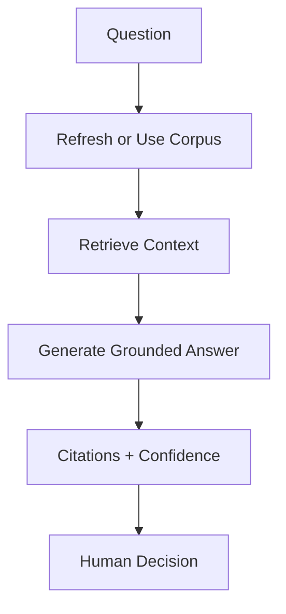
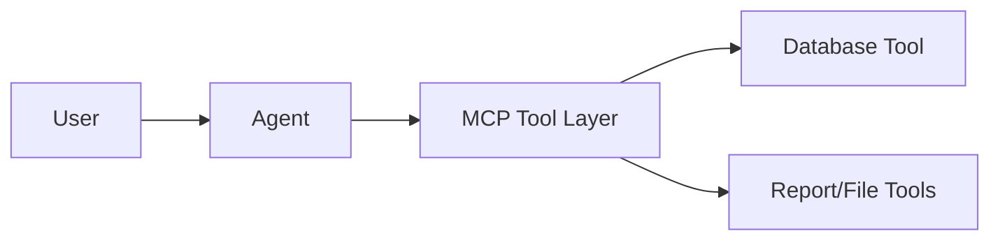
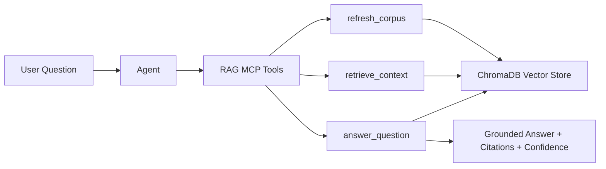

# Lab 08 - RAG and Enterprise Context Pipelines

**Course:** Advanced Software Development with Agentic AI (ASD) \
**Theme:** Local RAG, embeddings, vector search, and grounded responses \
**Primary IDE:** VS Code (Optional: AWS Kiro) \
**AI Runtime:** Ollama (open-source local models) \
**Duration:** 60 Minutes

---

## 1. Overview

<details>
<summary>Goal</summary>

### Goal
Add a local RAG layer to the existing `enrolment-app-open-ai/` project from Lab 07.

RAG in this lab means:
1. collect local context
2. chunk and embed
3. index in ChromaDB
4. retrieve relevant chunks
5. answer with citations and confidence

</details>

<details>
<summary>Scope</summary>

### Scope
In scope:
- local enterprise context sources (DB, reports, repo index)
- lightweight local deterministic embeddings
- local vector store (`chromadb`)
- MCP tools for RAG pipeline

Out of scope:
- hosted/commercial model APIs
- cloud vector DB services
- deployment work

</details>

<details>
<summary>Workflow</summary>

### Workflow


</details>

<details>
<summary>Expected results</summary>

### Expected results
- `rag-server/` added under `enrolment-app-open-ai/`
- RAG pipeline code implemented
- MCP RAG server tools implemented
- retrieval evaluation (`P@5`, `R@5`) produced
- evidence and audit artifacts recorded

</details>

<details>
<summary>Copy/Paste execution roots (do this first)</summary>

### Copy/Paste execution roots (do this first)
Use these exact commands so all relative paths in this lab work without edits.

Repository root (must contain `enrolment-app-open-ai/`):

Linux/macOS/Git Bash:
```bash
cd /path/to/agentic-ai-asd-2026
test -d enrolment-app-open-ai && echo ok_root
```

Windows PowerShell:
```powershell
cd .
if (Test-Path ".\enrolment-app-open-ai") { "ok_root" } else { "missing_app_folder" }
```

App root (for Docker commands):

Linux/macOS/Git Bash:
```bash
cd enrolment-app-open-ai
pwd
```

Windows PowerShell:
```powershell
cd enrolment-app-open-ai
Get-Location
```

</details>

---

## 2. Prerequisites and Configuration

<details>
<summary>Prerequisites</summary>

### Prerequisites
Complete:
- Lab 01 to Lab 07

Required:
- Python virtual environment
- Ollama running locally
- Models available: `qwen2.5:0.5b`, `llama3.1:8b`, `deepseek-r1:8b`
- Existing Lab 07 app structure:
  - `enrolment-app-open-ai/mcp-server/`
  - `enrolment-app-open-ai/reports/`
- Lab 05 workflow at repository root:
  - `.github/workflows/lab5-ci.yml`

</details>

<details>
<summary>Environment checks</summary>

### Environment checks
Linux/macOS/Git Bash:
```bash
docker --version
docker compose version
git --version
python --version
ollama --version
ollama list
```

Windows PowerShell:
```powershell
docker --version
docker compose version
git --version
python --version
& "$env:LOCALAPPDATA\Programs\Ollama\ollama.exe" --version
& "$env:LOCALAPPDATA\Programs\Ollama\ollama.exe" list
```

</details>

<details>
<summary>Verify models</summary>

### Verify models
Linux/macOS/Git Bash:
```bash
ollama pull qwen2.5:0.5b
ollama pull llama3.1:8b
ollama pull deepseek-r1:8b
```

Windows PowerShell:
```powershell
& "$env:LOCALAPPDATA\Programs\Ollama\ollama.exe" pull qwen2.5:0.5b
& "$env:LOCALAPPDATA\Programs\Ollama\ollama.exe" pull llama3.1:8b
& "$env:LOCALAPPDATA\Programs\Ollama\ollama.exe" pull deepseek-r1:8b
```

</details>

<details>
<summary>.env (project root inside app)</summary>

### `.env` (project root inside app)
Create/update `enrolment-app-open-ai/.env`:
```env
OLLAMA_BASE_URL=http://localhost:11434/v1
OLLAMA_MODEL=qwen2.5:0.5b
OLLAMA_REVIEW_MODEL=llama3.1:8b
OLLAMA_REASONING_MODEL=deepseek-r1:8b
```

</details>

---

## 3. Scenario Setup

<details>
<summary>Starting architecture (from Lab 07)</summary>

### Starting architecture (from Lab 07)


</details>

<details>
<summary>Lab 08 extension</summary>

### Lab 08 extension


</details>

<details>
<summary>Project structure</summary>

### Project structure
Lab 08 starts from completed Lab 07 structure and adds RAG files.

Lab 05 workflow remains at repository root:

```text
agentic-ai-asd-2026/
└── .github/
    └── workflows/
        └── lab5-ci.yml
```

```text
enrolment-app-open-ai/
│
├── docker-compose.yml
│
├── frontend-service/
│   ├── Dockerfile
│   ├── templates/
│   │   ├── index.html
│   │   └── tabs/
│   │       ├── normal.html
│   │       ├── ai-mode.html
│   │       ├── mcp.html
│   │       └── rag.html                  # Lab 08 add
│   └── css/
│       └── styles.css
│
├── enrolment-service/
│   ├── app.py
│   ├── requirements.txt
│   ├── Dockerfile
│   └── prompts/
│
├── database-service/
│   ├── init_db.py
│   ├── Dockerfile
│   └── data/
│       └── enrolment.db
│
├── mcp-server/
│   ├── server.py
│   ├── tools.py
│   └── requirements.txt
│
├── rag-server/                            # Lab 08 add
│   ├── Dockerfile                         # Lab 08 add
│   ├── .dockerignore                      # Lab 08 add
│   ├── rag_server.py                      # Lab 08 add
│   ├── rag_http_server.py                 # Lab 08 add
│   ├── rag_pipeline.py                    # Lab 08 add
│   ├── rag_eval.py                        # Lab 08 add
│   ├── requirements.txt                   # Lab 08 add
│   ├── mcp-config.json                    # Lab 08 add
│   ├── tool-contracts.md                  # Lab 08 add
│   ├── retrieval-metrics.md               # Lab 08 add
│   ├── rag-audit.jsonl                    # Lab 08 add
│   ├── corpus/
│   │   └── corpus.jsonl
│   └── chroma/
│
├── prompts/
│   ├── tool_selection_prompt.txt
│   ├── tool_review_prompt.txt
│   ├── integration_review_prompt.txt
│   ├── rag_implementation_prompt.txt      # Lab 08 add
│   ├── rag_review_prompt.txt              # Lab 08 add
│   └── rag_reasoning_prompt.txt           # Lab 08 add
│
└── reports/
    ├── report.json
    ├── report.md
    ├── run-view.md
    ├── tool-review.md
    ├── boundary-analysis.md
    ├── integration-report.md
    ├── run-report.md
    └── rag-report.md                      # Lab 08 add
```

</details>

<details>
<summary>Create workspace files</summary>

### Create workspace files
Run these commands from the **repository root** (the folder that contains `enrolment-app-open-ai`).

Linux/macOS/Git Bash:
```bash
mkdir -p enrolment-app-open-ai/rag-server/corpus
mkdir -p enrolment-app-open-ai/rag-server/chroma
mkdir -p enrolment-app-open-ai/prompts
mkdir -p enrolment-app-open-ai/reports
mkdir -p enrolment-app-open-ai/frontend-service/templates/tabs

touch enrolment-app-open-ai/rag-server/rag_server.py
touch enrolment-app-open-ai/rag-server/rag_http_server.py
touch enrolment-app-open-ai/rag-server/rag_pipeline.py
touch enrolment-app-open-ai/rag-server/rag_eval.py
touch enrolment-app-open-ai/rag-server/requirements.txt
touch enrolment-app-open-ai/rag-server/Dockerfile
touch enrolment-app-open-ai/rag-server/.dockerignore
touch enrolment-app-open-ai/rag-server/mcp-config.json
touch enrolment-app-open-ai/rag-server/tool-contracts.md
touch enrolment-app-open-ai/rag-server/retrieval-metrics.md
touch enrolment-app-open-ai/rag-server/rag-audit.jsonl
touch enrolment-app-open-ai/rag-server/corpus/corpus.jsonl

touch enrolment-app-open-ai/frontend-service/templates/tabs/rag.html

touch enrolment-app-open-ai/prompts/rag_implementation_prompt.txt
touch enrolment-app-open-ai/prompts/rag_review_prompt.txt
touch enrolment-app-open-ai/prompts/rag_reasoning_prompt.txt

touch enrolment-app-open-ai/reports/rag-report.md
```

Windows PowerShell:
```powershell
New-Item enrolment-app-open-ai\rag-server\corpus -ItemType Directory -Force | Out-Null
New-Item enrolment-app-open-ai\rag-server\chroma -ItemType Directory -Force | Out-Null
New-Item enrolment-app-open-ai\prompts -ItemType Directory -Force | Out-Null
New-Item enrolment-app-open-ai\reports -ItemType Directory -Force | Out-Null
New-Item enrolment-app-open-ai\frontend-service\templates\tabs -ItemType Directory -Force | Out-Null

New-Item enrolment-app-open-ai\rag-server\rag_server.py -ItemType File -Force | Out-Null
New-Item enrolment-app-open-ai\rag-server\rag_http_server.py -ItemType File -Force | Out-Null
New-Item enrolment-app-open-ai\rag-server\rag_pipeline.py -ItemType File -Force | Out-Null
New-Item enrolment-app-open-ai\rag-server\rag_eval.py -ItemType File -Force | Out-Null
New-Item enrolment-app-open-ai\rag-server\requirements.txt -ItemType File -Force | Out-Null
New-Item enrolment-app-open-ai\rag-server\Dockerfile -ItemType File -Force | Out-Null
New-Item enrolment-app-open-ai\rag-server\.dockerignore -ItemType File -Force | Out-Null
New-Item enrolment-app-open-ai\rag-server\mcp-config.json -ItemType File -Force | Out-Null
New-Item enrolment-app-open-ai\rag-server\tool-contracts.md -ItemType File -Force | Out-Null
New-Item enrolment-app-open-ai\rag-server\retrieval-metrics.md -ItemType File -Force | Out-Null
New-Item enrolment-app-open-ai\rag-server\rag-audit.jsonl -ItemType File -Force | Out-Null
New-Item enrolment-app-open-ai\rag-server\corpus\corpus.jsonl -ItemType File -Force | Out-Null

New-Item enrolment-app-open-ai\frontend-service\templates\tabs\rag.html -ItemType File -Force | Out-Null

New-Item enrolment-app-open-ai\prompts\rag_implementation_prompt.txt -ItemType File -Force | Out-Null
New-Item enrolment-app-open-ai\prompts\rag_review_prompt.txt -ItemType File -Force | Out-Null
New-Item enrolment-app-open-ai\prompts\rag_reasoning_prompt.txt -ItemType File -Force | Out-Null

New-Item enrolment-app-open-ai\reports\rag-report.md -ItemType File -Force | Out-Null
```

After file creation, populate code/config files using the exact copy-paste blocks in this lab:

```text
rag-server/requirements.txt           -> Section 4 (rag-server/requirements.txt)
prompts/rag_implementation_prompt.txt -> Section 4 (Prompt assets)
prompts/rag_review_prompt.txt         -> Section 4 (Prompt assets)
prompts/rag_reasoning_prompt.txt      -> Section 4 (Prompt assets)
rag-server/rag_pipeline.py            -> Section 4 (rag-server/rag_pipeline.py)
frontend-service/templates/index.html -> Section 4 (UI Update)
frontend-service/templates/tabs/rag.html -> Section 4 (UI Update)
frontend-service/css/styles.css       -> Section 4 (UI Update additions)
enrolment-service/app.py              -> Section 4 (Backend Update)
docker-compose.yml                    -> Section 4 (docker-compose.yml update)
rag-server/rag_http_server.py         -> Section 4 (rag-server/rag_http_server.py)
rag-server/Dockerfile                 -> Section 4 (rag-server/Dockerfile)
rag-server/.dockerignore              -> Section 4 (rag-server/.dockerignore)
rag-server/rag_server.py              -> Section 6 (rag-server/rag_server.py)
rag-server/tool-contracts.md          -> Section 6 (rag-server/tool-contracts.md)
rag-server/mcp-config.json            -> Section 6 (rag-server/mcp-config.json)
rag-server/rag_eval.py                -> Section 8 (rag-server/rag_eval.py)
```

Generated/output files can be created empty at first and filled by execution/results:

```text
rag-server/corpus/corpus.jsonl
rag-server/rag-audit.jsonl
rag-server/retrieval-metrics.md
reports/rag-report.md
```

</details>

---

## 4. RAG Pipeline Development

<details>
<summary>rag-server/requirements.txt</summary>

### `rag-server/requirements.txt`
```text
mcp
chromadb
requests
```

Install:
Run from the **repository root**.

Linux/macOS/Git Bash:
```bash
cd enrolment-app-open-ai/rag-server
python -m venv .venv
if [ -f .venv/bin/activate ]; then source .venv/bin/activate; else source .venv/Scripts/activate; fi
python -m pip install --upgrade pip
pip install -r requirements.txt
```

Windows PowerShell:
```powershell
cd enrolment-app-open-ai\rag-server
python -m venv .venv
.venv\Scripts\Activate.ps1
python -m pip install --upgrade pip
pip install -r requirements.txt
```

Dependency check:
```bash
python -c "import chromadb; print('dependencies_ok')"
```

PowerShell dependency check:
```powershell
python -c "import chromadb; print('dependencies_ok')"
```

</details>

<details>
<summary>Copy/paste alignment checks (quick self-audit)</summary>

### Copy/paste alignment checks (quick self-audit)
Run these checks before build/test to confirm file-path and code alignment.

Linux/macOS/Git Bash:
```bash
cd /path/to/agentic-ai-asd-2026/enrolment-app-open-ai
test -f rag-server/rag_pipeline.py && echo ok_rag_pipeline
test -f rag-server/rag_http_server.py && echo ok_rag_http
test -f frontend-service/templates/tabs/rag.html && echo ok_rag_tab
grep -n "RAG_SERVICE_URL\|RAG_ENABLED" enrolment-service/app.py
grep -n "rag-server\|RAG_SERVICE_URL\|RAG_ENABLED" docker-compose.yml
grep -n "X-RAG-Mode" frontend-service/templates/tabs/rag.html
```

Windows PowerShell:
```powershell
cd .\enrolment-app-open-ai
if (Test-Path ".\rag-server\rag_pipeline.py") { "ok_rag_pipeline" }
if (Test-Path ".\rag-server\rag_http_server.py") { "ok_rag_http" }
if (Test-Path ".\frontend-service\templates\tabs\rag.html") { "ok_rag_tab" }
Select-String -Path .\enrolment-service\app.py -Pattern "RAG_SERVICE_URL|RAG_ENABLED"
Select-String -Path .\docker-compose.yml -Pattern "rag-server|RAG_SERVICE_URL|RAG_ENABLED"
Select-String -Path .\frontend-service\templates\tabs\rag.html -Pattern "X-RAG-Mode"
```

</details>

<details>
<summary>Prompt assets</summary>

### Prompt assets
`enrolment-app-open-ai/prompts/rag_implementation_prompt.txt`
```text
Implement local RAG pipeline tools.

Constraints:
- local open-source stack only
- Python + chromadb + MCP
- no hosted commercial APIs

Required tools:
- refresh_corpus
- retrieve_context
- answer_question

Requirements:
- structured outputs
- structured errors
- citations
- confidence category
- audit logging
```

`enrolment-app-open-ai/prompts/rag_review_prompt.txt`
```text
Review RAG output quality.

Check:
- retrieval quality
- citation quality
- confidence justification
- unsupported claims

Return exactly:
Risk:
Correction:
Retest:
```

`enrolment-app-open-ai/prompts/rag_reasoning_prompt.txt`
```text
Evaluate RAG architecture.

Check:
- corpus design
- chunking
- embedding strategy
- vector store usage
- governance risks

Return:
Strengths:
Risks:
Recommendations:
```

</details>

<details>
<summary>rag-server/rag_pipeline.py</summary>

### `rag-server/rag_pipeline.py`
```python
import json
import os
import sqlite3
import time
import uuid
import hashlib
from datetime import datetime, timezone
from pathlib import Path
from typing import Any

import chromadb
import requests

BASE_DIR = Path(__file__).resolve().parent
APP_DIR = BASE_DIR.parent
REPORTS_DIR = APP_DIR / "reports"
CORPUS_PATH = BASE_DIR / "corpus" / "corpus.jsonl"
AUDIT_PATH = BASE_DIR / "rag-audit.jsonl"
CHROMA_PATH = BASE_DIR / "chroma"
DATABASE_SERVICE_URL = os.getenv("DATABASE_SERVICE_URL", "http://database-service:5002")

DB_PATH_CANDIDATES = [
    APP_DIR / "database-service" / "data" / "enrolment.db",
    APP_DIR / "database-service" / "enrolment.db",
    APP_DIR / "enrolment.db",
]

REPORT_FILES = [
    "report.json",
    "run-report.md",
    "integration-report.md",
    "tool-review.md",
    "boundary-analysis.md",
]

COLLECTION_NAME = "student_enrolment_enterprise_context"
EMBED_VECTOR_SIZE = 256

_collection = None
_last_corpus_chunks: list[dict[str, Any]] = []


def now_iso() -> str:
    return datetime.now(timezone.utc).isoformat()


def resolve_db_path() -> Path:
    for path in DB_PATH_CANDIDATES:
        if path.exists():
            return path
    return DB_PATH_CANDIDATES[0]


def embed_texts(texts: list[str]) -> list[list[float]]:
    vectors: list[list[float]] = []

    for text in texts:
        values = [0.0] * EMBED_VECTOR_SIZE
        tokens = (text or "").lower().split()

        if not tokens:
            vectors.append(values)
            continue

        for token in tokens:
            digest = hashlib.sha256(token.encode("utf-8")).digest()
            for i, byte in enumerate(digest):
                idx = i % EMBED_VECTOR_SIZE
                values[idx] += (byte / 255.0) - 0.5

        norm = sum(v * v for v in values) ** 0.5
        if norm > 0:
            values = [v / norm for v in values]

        vectors.append(values)

    return vectors


def get_collection():
    global _collection
    if _collection is None:
        client = chromadb.PersistentClient(path=str(CHROMA_PATH))
        _collection = client.get_or_create_collection(name=COLLECTION_NAME)
    return _collection


def reset_collection() -> None:
    global _collection
    client = chromadb.PersistentClient(path=str(CHROMA_PATH))
    try:
        client.delete_collection(name=COLLECTION_NAME)
    except Exception:
        pass
    _collection = client.get_or_create_collection(name=COLLECTION_NAME)


def append_audit(
    tool_name: str,
    tool_input: dict[str, Any],
    tool_output: dict[str, Any],
    validation_status: str,
    outcome: str,
    start_time: float,
) -> None:
    AUDIT_PATH.parent.mkdir(parents=True, exist_ok=True)
    duration_ms = int((time.time() - start_time) * 1000)
    record = {
        "request_id": str(uuid.uuid4()),
        "trace_id": str(uuid.uuid4()),
        "tool_name": tool_name,
        "tool_input": tool_input,
        "tool_output": tool_output,
        "timestamp": now_iso(),
        "duration_ms": duration_ms,
        "validation_status": validation_status,
        "outcome": outcome,
    }
    with AUDIT_PATH.open("a", encoding="utf-8") as f:
        f.write(json.dumps(record) + "\n")


def chunk_text(text: str, max_words: int = 80) -> list[str]:
    words = text.split()
    if not words:
        return []
    chunks = []
    for i in range(0, len(words), max_words):
        chunk = " ".join(words[i : i + max_words]).strip()
        if chunk:
            chunks.append(chunk)
    return chunks


def load_database_chunks() -> list[dict[str, Any]]:
    db_path = resolve_db_path()
    if not db_path.exists():
        # In containers, rag-server may not have direct filesystem access to SQLite.
        # Fallback to database-service HTTP API so tier_1 facts remain available.
        try:
            response = requests.get(f"{DATABASE_SERVICE_URL}/students", timeout=10)
            response.raise_for_status()
            students = response.json()

            chunks: list[dict[str, Any]] = [
                {
                    "chunk_id": "db_service_student_count",
                    "source_id": "database-service:/students",
                    "authority_tier": "tier_1",
                    "text": f"Student count is {len(students)}.",
                    "metadata": {"source_type": "database_service", "metric": "count"},
                    "indexed_at": now_iso(),
                }
            ]

            for row in students[:500]:
                sid = row.get("student_id", "unknown")
                sname = row.get("student_name", "unknown")
                subject = row.get("subject_code", "unknown")
                chunks.append(
                    {
                        "chunk_id": f"db_service_student_{sid}",
                        "source_id": "database-service:/students",
                        "authority_tier": "tier_1",
                        "text": (
                            f"Student record: student_id={sid}, "
                            f"student_name={sname}, subject_code={subject}."
                        ),
                        "metadata": {"source_type": "database_service", "table": "students"},
                        "indexed_at": now_iso(),
                    }
                )

            return chunks
        except Exception as exc:
            return [
                {
                    "chunk_id": "db_missing",
                    "source_id": str(db_path.relative_to(APP_DIR)) if db_path.is_absolute() else str(db_path),
                    "authority_tier": "tier_1",
                    "text": (
                        f"Database file not found: {db_path}. "
                        f"database-service fallback failed: {exc}"
                    ),
                    "metadata": {"source_type": "database", "exists": False},
                    "indexed_at": now_iso(),
                }
            ]

    conn = sqlite3.connect(db_path)
    conn.row_factory = sqlite3.Row
    chunks: list[dict[str, Any]] = []
    try:
        tables = [
            row["name"]
            for row in conn.execute("SELECT name FROM sqlite_master WHERE type='table'").fetchall()
        ]
        chunks.append(
            {
                "chunk_id": "db_schema",
                "source_id": str(db_path.relative_to(APP_DIR)),
                "authority_tier": "tier_1",
                "text": f"Database tables: {', '.join(tables)}",
                "metadata": {"source_type": "database", "tables": tables},
                "indexed_at": now_iso(),
            }
        )

        if "students" in tables:
            row = conn.execute("SELECT COUNT(*) AS count FROM students").fetchone()
            count = row["count"] if row else 0
            chunks.append(
                {
                    "chunk_id": "db_student_count",
                    "source_id": str(db_path.relative_to(APP_DIR)),
                    "authority_tier": "tier_1",
                    "text": f"Student count is {count}.",
                    "metadata": {"source_type": "database", "table": "students", "metric": "count"},
                    "indexed_at": now_iso(),
                }
            )

            for row in conn.execute(
                "SELECT student_id, student_name, subject_code FROM students ORDER BY student_id LIMIT 500"
            ).fetchall():
                r = dict(row)
                chunks.append(
                    {
                        "chunk_id": f"db_student_{r['student_id']}",
                        "source_id": str(db_path.relative_to(APP_DIR)),
                        "authority_tier": "tier_1",
                        "text": (
                            f"Student record: student_id={r['student_id']}, "
                            f"student_name={r['student_name']}, subject_code={r['subject_code']}."
                        ),
                        "metadata": {"source_type": "database", "table": "students"},
                        "indexed_at": now_iso(),
                    }
                )
    finally:
        conn.close()

    return chunks


def load_report_chunks() -> list[dict[str, Any]]:
    chunks: list[dict[str, Any]] = []
    for name in REPORT_FILES:
        path = REPORTS_DIR / name
        if not path.exists():
            continue

        text = ""
        try:
            if path.suffix == ".json":
                text = json.dumps(json.loads(path.read_text(encoding="utf-8")), indent=2)
            else:
                text = path.read_text(encoding="utf-8", errors="ignore")
        except Exception:
            text = path.read_text(encoding="utf-8", errors="ignore")

        for i, chunk in enumerate(chunk_text(text), start=1):
            chunks.append(
                {
                    "chunk_id": f"{path.stem}_{i}",
                    "source_id": f"reports/{name}",
                    "authority_tier": "tier_2",
                    "text": chunk,
                    "metadata": {"source_type": "report", "file": name},
                    "indexed_at": now_iso(),
                }
            )

    return chunks


def load_repository_chunks() -> list[dict[str, Any]]:
    ignored = {".git", ".venv", "__pycache__", "node_modules", "chroma"}
    files: list[str] = []

    for root, dirs, filenames in os.walk(APP_DIR, topdown=True, followlinks=False, onerror=lambda e: None):
        # Prune ignored and symlinked directories to avoid scanning protected mounts.
        pruned_dirs: list[str] = []
        for directory_name in dirs:
            if directory_name in ignored:
                continue
            directory_path = Path(root) / directory_name
            try:
                if directory_path.is_symlink():
                    continue
            except OSError:
                continue
            pruned_dirs.append(directory_name)
        dirs[:] = pruned_dirs

        for filename in filenames:
            file_path = Path(root) / filename
            try:
                if file_path.is_symlink():
                    continue
                rel = file_path.relative_to(APP_DIR)
                files.append(str(rel).replace("\\", "/"))
            except (OSError, ValueError):
                continue

    text = "Repository files include: " + ", ".join(sorted(files[:400]))
    return [
        {
            "chunk_id": "repo_index",
            "source_id": "repository",
            "authority_tier": "tier_3",
            "text": text,
            "metadata": {"source_type": "repository", "file_count": len(files)},
            "indexed_at": now_iso(),
        }
    ]


def build_corpus() -> list[dict[str, Any]]:
    chunks: list[dict[str, Any]] = []
    chunks.extend(load_database_chunks())
    chunks.extend(load_report_chunks())
    chunks.extend(load_repository_chunks())
    return chunks


def write_corpus(chunks: list[dict[str, Any]]) -> None:
    CORPUS_PATH.parent.mkdir(parents=True, exist_ok=True)
    with CORPUS_PATH.open("w", encoding="utf-8") as f:
        for chunk in chunks:
            f.write(json.dumps(chunk) + "\n")


def read_corpus() -> list[dict[str, Any]]:
    if not CORPUS_PATH.exists():
        return []

    chunks: list[dict[str, Any]] = []
    with CORPUS_PATH.open("r", encoding="utf-8") as f:
        for line in f:
            line = line.strip()
            if not line:
                continue
            try:
                chunks.append(json.loads(line))
            except json.JSONDecodeError:
                continue
    return chunks


def lexical_fallback_retrieve(query: str, k: int) -> list[dict[str, Any]]:
    corpus = _last_corpus_chunks or read_corpus()
    query_tokens = set((query or "").lower().split())
    tier_weight = {"tier_1": 3, "tier_2": 2, "tier_3": 1}

    scored = []
    for chunk in corpus:
        text = chunk.get("text", "")
        text_tokens = set(text.lower().split())
        overlap = len(query_tokens.intersection(text_tokens))
        scored.append(
            {
                "rank": 0,
                "chunk_id": chunk.get("chunk_id"),
                "source_id": chunk.get("source_id"),
                "authority_tier": chunk.get("authority_tier"),
                "distance": None,
                "text": text,
                "_score": overlap,
            }
        )

    scored.sort(
        key=lambda r: (
            tier_weight.get(r.get("authority_tier"), 0),
            r.get("_score", 0),
        ),
        reverse=True,
    )

    top = scored[: max(k, 1)]
    for i, row in enumerate(top, start=1):
        row["rank"] = i
        row.pop("_score", None)
    return top


def refresh_corpus(caller: str = "student") -> dict[str, Any]:
    global _last_corpus_chunks
    start = time.time()
    try:
        chunks = build_corpus()
        _last_corpus_chunks = chunks
        write_corpus(chunks)
        vector_store_status = "ready"
        vector_store_error = None

        try:
            reset_collection()
            collection = get_collection()

            if chunks:
                ids = [c["chunk_id"] for c in chunks]
                docs = [c["text"] for c in chunks]
                metas = [
                    {
                        "source_id": c["source_id"],
                        "authority_tier": c["authority_tier"],
                        "indexed_at": c["indexed_at"],
                    }
                    for c in chunks
                ]
                embeddings = embed_texts(docs)
                collection.add(ids=ids, documents=docs, metadatas=metas, embeddings=embeddings)
        except Exception as exc:
            vector_store_status = "degraded"
            vector_store_error = str(exc)

        output = {
            "status": "success",
            "caller": caller,
            "chunk_count": len(chunks),
            "collection": COLLECTION_NAME,
            "corpus_path": str(CORPUS_PATH),
            "vector_store_status": vector_store_status,
        }
        if vector_store_error:
            output["vector_store_error"] = vector_store_error
        append_audit("refresh_corpus", {"caller": caller}, output, "pass", "corpus_refreshed", start)
        return output
    except Exception as exc:
        output = {"status": "error", "error": str(exc)}
        append_audit("refresh_corpus", {"caller": caller}, output, "fail", "error", start)
        return output


def retrieve_context(query: str, k: int = 5, caller: str = "student") -> dict[str, Any]:
    start = time.time()
    try:
        retrieval_mode = "vector"
        ranked = []

        try:
            collection = get_collection()
            if collection.count() == 0:
                refreshed = refresh_corpus(caller="auto_refresh")
                if refreshed.get("status") != "success":
                    raise RuntimeError("empty_collection")

            query_embedding = embed_texts([query])
            results = collection.query(query_embeddings=query_embedding, n_results=k)

            ids = (results.get("ids") or [[]])[0]
            docs = (results.get("documents") or [[]])[0]
            metas = (results.get("metadatas") or [[]])[0]
            distances = (results.get("distances") or [[]])[0]

            for i, chunk_id in enumerate(ids):
                row_meta = metas[i] if i < len(metas) and isinstance(metas[i], dict) else {}
                ranked.append(
                    {
                        "rank": i + 1,
                        "chunk_id": chunk_id,
                        "source_id": row_meta.get("source_id"),
                        "authority_tier": row_meta.get("authority_tier"),
                        "distance": distances[i] if i < len(distances) else None,
                        "text": docs[i] if i < len(docs) else "",
                    }
                )

            tier_weight = {"tier_1": 3, "tier_2": 2, "tier_3": 1}
            ranked.sort(
                key=lambda x: (
                    tier_weight.get(x.get("authority_tier"), 0),
                    -(x.get("distance") if isinstance(x.get("distance"), (int, float)) else 1e9),
                ),
                reverse=True,
            )
        except Exception:
            retrieval_mode = "lexical_fallback"
            if not _last_corpus_chunks and not CORPUS_PATH.exists():
                refreshed = refresh_corpus(caller="auto_refresh")
                if refreshed.get("status") != "success":
                    return {"status": "error", "error": "corpus_unavailable"}
            ranked = lexical_fallback_retrieve(query, k)

        output = {
            "status": "success",
            "query": query,
            "caller": caller,
            "k": k,
            "retrieval_mode": retrieval_mode,
            "results": ranked,
        }

        append_audit(
            "retrieve_context",
            {"query": query, "k": k, "caller": caller},
            {"result_count": len(ranked), "chunk_ids": [r["chunk_id"] for r in ranked]},
            "pass",
            "context_retrieved",
            start,
        )
        return output
    except Exception as exc:
        output = {"status": "error", "error": str(exc), "query": query}
        append_audit(
            "retrieve_context",
            {"query": query, "k": k, "caller": caller},
            output,
            "fail",
            "error",
            start,
        )
        return output


def confidence_from_results(results: list[dict[str, Any]]) -> str:
    if not results:
        return "Unknown"
    tier_1 = sum(1 for r in results if r.get("authority_tier") == "tier_1")
    tier_2 = sum(1 for r in results if r.get("authority_tier") == "tier_2")
    if tier_1 >= 2 and len(results) >= 3:
        return "High"
    if tier_1 >= 1 or tier_2 >= 2:
        return "Medium"
    return "Low"


def extract_student_records(results: list[dict[str, Any]]) -> list[dict[str, str]]:
    records: list[dict[str, str]] = []
    for row in results:
        text = row.get("text", "")
        if "Student record:" not in text:
            continue

        payload = text.split("Student record:", 1)[1].strip().rstrip(".")
        parts = [p.strip() for p in payload.split(",")]
        values: dict[str, str] = {}
        for part in parts:
            if "=" not in part:
                continue
            key, value = part.split("=", 1)
            values[key.strip()] = value.strip()

        if values.get("student_id") and values.get("subject_code"):
            records.append(values)

    # Keep stable ordering by numeric student_id when possible.
    def key_fn(item: dict[str, str]):
        sid = item.get("student_id", "")
        return (0, int(sid)) if sid.isdigit() else (1, sid)

    records.sort(key=key_fn)
    return records


def deterministic_answer(query: str, results: list[dict[str, Any]]) -> str | None:
    q = (query or "").lower()
    records = extract_student_records(results)
    if not records:
        return None

    if "student ids and subject codes" in q or "student id and subject code" in q:
        lines = [f"{r.get('student_id')} -> {r.get('subject_code')}" for r in records]
        return "Answer:\n" + "\n".join(lines)

    if "how many students" in q or "student count" in q:
        return f"Answer:\nThere are {len(records)} students in the retrieved evidence."

    return None


def generate_with_ollama(query: str, context: str) -> str:
    model_name = os.getenv("OLLAMA_MODEL", "qwen2.5:0.5b")
    ollama_generate_url = os.getenv("OLLAMA_GENERATE_URL", "http://host.docker.internal:11434/api/generate")
    prompt = f"""
You are a retrieval-grounded assistant.
Use only the provided context.
If evidence is missing, return exactly: Insufficient evidence.

QUESTION:
{query}

CONTEXT:
{context}

Return exactly:
Answer:
<answer>

Evidence:
<summary>
"""

    try:
        resp = requests.post(
            ollama_generate_url,
            json={"model": model_name, "prompt": prompt, "stream": False},
            timeout=120,
        )
        resp.raise_for_status()
        return resp.json().get("response", "Insufficient evidence.")
    except Exception as exc:
        return f"Ollama unavailable: {exc}"


def answer_question(query: str, k: int = 5, caller: str = "student") -> dict[str, Any]:
    start = time.time()
    retrieval = retrieve_context(query=query, k=k, caller=caller)
    if retrieval.get("status") != "success":
        output = {"status": "error", "query": query, "error": retrieval.get("error", "retrieval_failed")}
        append_audit(
            "answer_question",
            {"query": query, "k": k, "caller": caller},
            output,
            "fail",
            "retrieval_failed",
            start,
        )
        return output

    results = retrieval.get("results", [])
    context = "\n\n".join(r.get("text", "") for r in results)
    answer = deterministic_answer(query, results)
    if answer is None:
        answer = generate_with_ollama(query, context)

    citations = [
        {
            "chunk_id": r.get("chunk_id"),
            "source_id": r.get("source_id"),
            "authority_tier": r.get("authority_tier"),
        }
        for r in results
    ]

    confidence = confidence_from_results(results)
    output = {
        "status": "success",
        "query": query,
        "answer": answer,
        "citations": citations,
        "confidence_category": confidence,
        "retrieval_summary": {
            "k": k,
            "retrieved_count": len(results),
            "top_chunk": results[0].get("chunk_id") if results else None,
        },
    }

    append_audit(
        "answer_question",
        {"query": query, "k": k, "caller": caller},
        {"confidence_category": confidence, "citation_count": len(citations)},
        "pass",
        "answer_generated",
        start,
    )
    return output


if __name__ == "__main__":
    print(json.dumps(refresh_corpus(), indent=2))
    print(json.dumps(retrieve_context("students enrolled in ASD101", 5), indent=2))
    print(json.dumps(answer_question("Which students are enrolled in ASD101?", 5), indent=2))
```

Run:
Linux/macOS/Git Bash:
```bash
cd enrolment-app-open-ai/rag-server
if [ -f .venv/bin/activate ]; then source .venv/bin/activate; else source .venv/Scripts/activate; fi
python rag_pipeline.py
```

Windows PowerShell:
```powershell
cd enrolment-app-open-ai\rag-server
.venv\Scripts\Activate.ps1
python rag_pipeline.py
```

Expected:
- `refresh_corpus` returns `status: success`
- `retrieve_context` returns `results`
- `answer_question` returns answer + citations + confidence

</details>

<details>
<summary> Update Scope (Lab 07 Style Baseline)</summary>

Lab 08 extends the Lab 07 tabbed architecture.

Required updates in this section:

* UI update: enable a dedicated RAG tab in the existing tabbed frontend.
* Backend update: add RAG proxy endpoints in `enrolment-service` and connect to `rag-server`.

The Normal UI, AI Mode, and MCP tabs remain unchanged from Lab 07.

</details>

<details>
<summary> UI Update (Tabbed Frontend RAG)</summary>

Update these frontend files:

```text
enrolment-app-open-ai/frontend-service/templates/index.html
enrolment-app-open-ai/frontend-service/templates/tabs/rag.html
enrolment-app-open-ai/frontend-service/css/styles.css
```

### `frontend-service/templates/index.html`

Enable the RAG tab and add a tab frame.

```html
<!DOCTYPE html>
<html>
<head>
    <title>Student Enrolment App</title>
    <link rel="stylesheet" href="css/styles.css">
</head>
<body>
<main class="app-shell">
    <header class="app-header">
        <h1>Student Enrolment App</h1>
        <p>HTMX UI: Normal UI, AI Mode, MCP, RAG, Multi-Agent</p>
    </header>

    <section class="tab-shell card">
        <nav class="tab-nav" aria-label="Application tabs">
            <button class="tab-btn is-active" data-tab="normal" type="button">Normal UI</button>
            <button class="tab-btn" data-tab="ai-mode" type="button">AI Mode</button>
            <button class="tab-btn" data-tab="mcp" type="button">MCP</button>
            <button class="tab-btn" data-tab="rag" type="button">RAG</button>
            <button class="tab-btn" data-tab="multi-agent" type="button" disabled title="Added in Lab 10">Multi-Agent (Lab 10)</button>
        </nav>

        <div class="tab-content">
            <iframe id="tab-frame-normal" class="tab-frame is-active" src="tabs/normal.html" title="Normal UI tab"></iframe>
            <iframe id="tab-frame-ai-mode" class="tab-frame" src="tabs/ai-mode.html" title="AI Mode tab"></iframe>
            <iframe id="tab-frame-mcp" class="tab-frame" src="tabs/mcp.html" title="MCP tab"></iframe>
            <iframe id="tab-frame-rag" class="tab-frame" src="tabs/rag.html" title="RAG tab"></iframe>
        </div>
    </section>
</main>

<script>
const tabButtons = Array.from(document.querySelectorAll(".tab-btn"));
const tabFrames = {
    normal: document.getElementById("tab-frame-normal"),
    "ai-mode": document.getElementById("tab-frame-ai-mode"),
    mcp: document.getElementById("tab-frame-mcp"),
    rag: document.getElementById("tab-frame-rag"),
};

function activateTab(tabName) {
    tabButtons.forEach((button) => {
        button.classList.toggle("is-active", button.dataset.tab === tabName);
    });

    Object.entries(tabFrames).forEach(([name, frame]) => {
        frame.classList.toggle("is-active", name === tabName);
    });

    window.location.hash = tabName;
}

tabButtons.forEach((button) => {
    if (button.disabled) {
        return;
    }

    button.addEventListener("click", () => {
        activateTab(button.dataset.tab);
    });
});

const hashTab = window.location.hash.replace("#", "");
if (hashTab && tabFrames[hashTab]) {
    activateTab(hashTab);
} else {
    activateTab("normal");
}
</script>

</body>
</html>
```

### `frontend-service/templates/tabs/rag.html`

```html
<!DOCTYPE html>
<html>
<head>
    <meta charset="utf-8">
    <title>RAG Tab</title>
    <link rel="stylesheet" href="../css/styles.css">
</head>
<body>
<section class="card">
    <h2>RAG Mode</h2>
    <p>Refresh corpus, retrieve context, and generate grounded answers with citations.</p>

    <div class="feature-toggle-row">
        <label class="toggle-switch" for="rag-mode-toggle">
            <input id="rag-mode-toggle" type="checkbox" checked>
            <span class="toggle-label">RAG Enabled</span>
        </label>
        <span id="rag-mode-state" class="feature-state feature-on">ON</span>
    </div>

    <form id="rag-refresh-form" class="stack-form">
        <button type="submit" class="rag-action">Refresh Corpus</button>
    </form>

    <form id="rag-retrieve-form" class="stack-form">
        <label for="rag-retrieve-query">Query</label>
        <input
            id="rag-retrieve-query"
            name="query"
            required
            placeholder="Example: students enrolled in ASD101"
        >
        <p class="rag-helper">Hint: use short retrieval phrases.</p>
        <button type="submit" class="rag-action">Retrieve Context</button>
    </form>

    <form id="rag-answer-form" class="stack-form">
        <label for="rag-answer-query">Question</label>
        <input
            id="rag-answer-query"
            name="query"
            required
            placeholder="Example: Which students are enrolled in ASD101?"
        >
        <p class="rag-helper">Hint: ask a full question for grounded answers.</p>
        <button type="submit" class="rag-action">Answer with Citations</button>
    </form>

    <div id="rag-results" class="panel panel-mcp">RAG responses will appear here.</div>
</section>

<script>
const apiBase = "http://localhost:5001";
const output = document.getElementById("rag-results");
const ragModeToggle = document.getElementById("rag-mode-toggle");
const ragModeState = document.getElementById("rag-mode-state");
const RAG_STORAGE_KEY = "rag_mode_enabled";

function isRagEnabled() {
    return ragModeToggle.checked;
}

function renderRagState() {
    if (isRagEnabled()) {
        ragModeState.textContent = "ON";
        ragModeState.classList.add("feature-on");
        ragModeState.classList.remove("feature-off");
    } else {
        ragModeState.textContent = "OFF";
        ragModeState.classList.add("feature-off");
        ragModeState.classList.remove("feature-on");
    }
}

function renderRagDisabledMessage() {
    output.innerHTML = "<p>RAG Mode is OFF. Enable RAG Mode to run RAG tools.</p>";
}

function saveRagMode() {
    localStorage.setItem(RAG_STORAGE_KEY, String(isRagEnabled()));
}

function loadRagMode() {
    const persisted = localStorage.getItem(RAG_STORAGE_KEY);
    if (persisted === null) {
        ragModeToggle.checked = true;
    } else {
        ragModeToggle.checked = persisted === "true";
    }
    renderRagState();
}

function renderJson(title, payload) {
    output.innerHTML = `<h3>${title}</h3><pre>${JSON.stringify(payload, null, 2)}</pre>`;
}

async function postForm(path, data) {
    if (!isRagEnabled()) {
        renderRagDisabledMessage();
        return { status: "error", error: "RAG Mode is OFF" };
    }

    const res = await fetch(`${apiBase}${path}`, {
        method: "POST",
        headers: {
            "Content-Type": "application/x-www-form-urlencoded",
            "X-RAG-Mode": isRagEnabled() ? "on" : "off",
        },
        body: new URLSearchParams(data),
    });
    const text = await res.text();
    try {
        return JSON.parse(text);
    } catch {
        return { raw: text };
    }
}

ragModeToggle.addEventListener("change", () => {
    saveRagMode();
    renderRagState();

    if (!isRagEnabled()) {
        renderRagDisabledMessage();
    }
});

document.getElementById("rag-refresh-form").addEventListener("submit", async (e) => {
    e.preventDefault();
    const payload = await postForm("/rag/refresh", {});
    renderJson("RAG Tool: refresh_corpus", payload);
});

document.getElementById("rag-retrieve-form").addEventListener("submit", async (e) => {
    e.preventDefault();
    const query = document.getElementById("rag-retrieve-query").value.trim();
    const payload = await postForm("/rag/retrieve", { query, k: "5" });
    renderJson("RAG Tool: retrieve_context", payload);
});

document.getElementById("rag-answer-form").addEventListener("submit", async (e) => {
    e.preventDefault();
    const query = document.getElementById("rag-answer-query").value.trim();
    const payload = await postForm("/rag/answer", { query, k: "5" });
    renderJson("RAG Tool: answer_question", payload);
});

loadRagMode();
if (!isRagEnabled()) {
    renderRagDisabledMessage();
}
</script>

</body>
</html>
```

### `frontend-service/css/styles.css` additions

```css
.stack-form {
    display: grid;
    gap: 0.5rem;
    margin-bottom: 1rem;
}

.rag-action {
    justify-self: start;
    width: auto;
}

.rag-helper {
    margin: -0.2rem 0 0;
    font-size: 0.86rem;
    color: var(--muted);
}

.result-box {
    margin-top: 1rem;
    padding: 0.75rem;
    border: 1px solid #d5dbe3;
    border-radius: 8px;
    background: #f9fbfd;
}
```

</details>

<details>
<summary>Backend Update (RAG Integration Endpoints)</summary>

Update these backend files:

```text
enrolment-app-open-ai/enrolment-service/app.py
enrolment-app-open-ai/docker-compose.yml
enrolment-app-open-ai/rag-server/rag_http_server.py
enrolment-app-open-ai/rag-server/Dockerfile
enrolment-app-open-ai/rag-server/.dockerignore
```

<details>
<summary>enrolment-service/app.py</summary>

### `enrolment-service/app.py` additions

Add RAG service configuration near existing environment variables:

```python
RAG_SERVICE_URL = os.getenv("RAG_SERVICE_URL", "http://rag-server:5003")
RAG_ENABLED = os.getenv("RAG_ENABLED", "true").strip().lower() in ("1", "true", "yes", "on")
try:
    RAG_SERVICE_TIMEOUT_SECONDS = int(os.getenv("RAG_SERVICE_TIMEOUT_SECONDS", "180"))
except ValueError:
    RAG_SERVICE_TIMEOUT_SECONDS = 180
```

Add helper functions:

```python
def rag_mode_is_enabled(req) -> bool:
    if not RAG_ENABLED:
        return False

    mode_header = req.headers.get("X-RAG-Mode", "on").strip().lower()
    return mode_header in ("1", "true", "yes", "on")


def rag_disabled_response():
    return {"status": "error", "error": "RAG mode is disabled."}, 403


def call_rag_service(path: str, payload: dict):
    response = requests.post(
        f"{RAG_SERVICE_URL}{path}",
        json=payload,
        timeout=RAG_SERVICE_TIMEOUT_SECONDS,
    )

    try:
        data = response.json()
    except ValueError:
        response.raise_for_status()
        return {}

    if response.status_code >= 400:
        raise requests.HTTPError(
            f"RAG service {path} failed with status {response.status_code}: {data}",
            response=response,
        )

    return data
```

Add endpoints:

```python
@app.post("/rag/refresh")
def rag_refresh():
    if not rag_mode_is_enabled(request):
        return rag_disabled_response()

    caller = request.form.get("caller", "student").strip() or "student"
    try:
        payload = call_rag_service("/refresh", {"caller": caller})
        return payload, 200
    except requests.RequestException as exc:
        return {"status": "error", "error": str(exc)}, 503


@app.post("/rag/retrieve")
def rag_retrieve():
    if not rag_mode_is_enabled(request):
        return rag_disabled_response()

    query = request.form.get("query", "").strip()
    k = int(request.form.get("k", "5"))
    if not query:
        return {"status": "error", "error": "query is required"}, 400

    try:
        payload = call_rag_service("/retrieve", {"query": query, "k": k, "caller": "student"})
        return payload, 200
    except requests.RequestException as exc:
        return {"status": "error", "error": str(exc)}, 503


@app.post("/rag/answer")
def rag_answer():
    if not rag_mode_is_enabled(request):
        return rag_disabled_response()

    query = request.form.get("query", "").strip()
    k = int(request.form.get("k", "5"))
    if not query:
        return {"status": "error", "error": "query is required"}, 400

    try:
        payload = call_rag_service("/answer", {"query": query, "k": k, "caller": "student"})
        return payload, 200
    except requests.RequestException as exc:
        return {"status": "error", "error": str(exc)}, 503
```

</details>

<details>
<summary>docker-compose.yml</summary>

### `docker-compose.yml` update

Add `rag-server` service and connect it to `enrolment-service`:

```yaml
  rag-server:
    build:
      context: ./rag-server
    container_name: rag-server
    ports:
      - "5003:5003"
    restart: unless-stopped

  enrolment-service:
    environment:
      RAG_SERVICE_URL: http://rag-server:5003
      RAG_ENABLED: "true"
    depends_on:
      - database-service
      - rag-server
```

</details>

<details>
<summary>rag-server/rag_http_server.py</summary>

Add a lightweight HTTP bridge so `enrolment-service` can call RAG tools using JSON over HTTP.

```python
import json
import os
from http.server import BaseHTTPRequestHandler, ThreadingHTTPServer

from rag_pipeline import answer_question, refresh_corpus, retrieve_context


class RAGHandler(BaseHTTPRequestHandler):
    def _send_json(self, status_code: int, payload: dict):
        response = json.dumps(payload).encode("utf-8")
        self.send_response(status_code)
        self.send_header("Content-Type", "application/json")
        self.send_header("Content-Length", str(len(response)))
        self.end_headers()
        self.wfile.write(response)

    def _read_json(self):
        content_length = int(self.headers.get("Content-Length", "0"))
        if content_length == 0:
            return {}
        raw = self.rfile.read(content_length)
        if not raw:
            return {}
        return json.loads(raw.decode("utf-8"))

    def do_GET(self):
        if self.path == "/health":
            self._send_json(200, {"status": "ok", "service": "rag-server"})
            return
        self._send_json(404, {"status": "error", "error": "not_found"})

    def do_POST(self):
        try:
            payload = self._read_json()
        except Exception as exc:
            self._send_json(400, {"status": "error", "error": f"invalid_json: {exc}"})
            return

        try:
            if self.path == "/refresh":
                caller = (payload.get("caller") or "student").strip() or "student"
                result = refresh_corpus(caller=caller)
                self._send_json(200 if result.get("status") == "success" else 500, result)
                return

            if self.path == "/retrieve":
                query = (payload.get("query") or "").strip()
                if not query:
                    self._send_json(400, {"status": "error", "error": "query is required"})
                    return
                k = int(payload.get("k", 5))
                caller = (payload.get("caller") or "student").strip() or "student"
                result = retrieve_context(query=query, k=k, caller=caller)
                self._send_json(200 if result.get("status") == "success" else 500, result)
                return

            if self.path == "/answer":
                query = (payload.get("query") or "").strip()
                if not query:
                    self._send_json(400, {"status": "error", "error": "query is required"})
                    return
                k = int(payload.get("k", 5))
                caller = (payload.get("caller") or "student").strip() or "student"
                result = answer_question(query=query, k=k, caller=caller)
                self._send_json(200 if result.get("status") == "success" else 500, result)
                return

            self._send_json(404, {"status": "error", "error": "not_found"})
        except Exception as exc:
            self._send_json(500, {"status": "error", "error": str(exc)})


def main():
    host = "0.0.0.0"
    port = int(os.getenv("PORT", "5003"))
    server = ThreadingHTTPServer((host, port), RAGHandler)
    print(f"RAG HTTP server running on {host}:{port}")
    server.serve_forever()


if __name__ == "__main__":
    main()
```

</details>

<details>
<summary>rag-server/Dockerfile</summary>

```dockerfile
FROM python:3.11-slim

WORKDIR /app

COPY requirements.txt .
RUN pip install --no-cache-dir -r requirements.txt

COPY . .

EXPOSE 5003

CMD ["python", "rag_http_server.py"]
```

</details>

<details>
<summary>rag-server/.dockerignore</summary>

```text
.venv
__pycache__
*.pyc
chroma
corpus
rag-audit.jsonl
```

</details>

</details>

---

## 5. UI Testing and Validation

<details>
<summary>UI Test Plan (RAG Tab)</summary>

Validate these flows from the browser at `http://localhost:8080`:

1. Open the `RAG` tab.
2. Click `Refresh Corpus`.
3. Run `Retrieve Context` with query: `students enrolled in ASD101`.
4. Run `Answer with Citations` with question: `Which students are enrolled in ASD101?`.

Expected UI results:

* Each action renders JSON in the RAG results area.
* `retrieve_context` includes ranked results with source and authority tier.
* `answer_question` includes `answer`, `citations`, and `confidence_category`.

</details>

<details>
<summary>UI-Driven Backend Smoke Tests</summary>

Run from `enrolment-app-open-ai/`.

**Linux / macOS / Git Bash**

```bash
docker compose up --build -d
curl -X POST http://localhost:5001/rag/refresh
curl -X POST http://localhost:5001/rag/retrieve -d "query=students enrolled in ASD101&k=5"
curl -X POST http://localhost:5001/rag/answer -d "query=Which students are enrolled in ASD101?&k=5"
```

**Windows PowerShell**

```powershell
cd .\enrolment-app-open-ai
docker compose up --build -d
Invoke-RestMethod -Uri "http://localhost:5001/rag/refresh" -Method Post
Invoke-RestMethod -Uri "http://localhost:5001/rag/retrieve" -Method Post -Body @{ query = "students enrolled in ASD101"; k = "5" }
Invoke-RestMethod -Uri "http://localhost:5001/rag/answer" -Method Post -Body @{ query = "Which students are enrolled in ASD101?"; k = "5" }
```

Pass criteria:

* All endpoints return `status: success`.
* Retrieval returns chunk evidence.
* Answer returns grounded output with citations.

</details>

---

## 6. MCP RAG Server Setup

<details>
<summary>rag-server/rag_server.py</summary>

### `rag-server/rag_server.py`
```python
from mcp.server.fastmcp import FastMCP

from rag_pipeline import answer_question as answer_question_impl
from rag_pipeline import refresh_corpus as refresh_corpus_impl
from rag_pipeline import retrieve_context as retrieve_context_impl

mcp = FastMCP("Student Enrolment RAG MCP")
AVAILABLE_TOOLS = ["refresh_corpus", "retrieve_context", "answer_question"]


@mcp.tool()
def refresh_corpus(caller: str = "student"):
    return refresh_corpus_impl(caller=caller)


@mcp.tool()
def retrieve_context(query: str, k: int = 5, caller: str = "student"):
    return retrieve_context_impl(query=query, k=k, caller=caller)


@mcp.tool()
def answer_question(query: str, k: int = 5, caller: str = "student"):
    return answer_question_impl(query=query, k=k, caller=caller)


if __name__ == "__main__":
    print("Starting Student Enrolment RAG MCP Server...")
    print("Server status: RUNNING")
    print("Interact with RAG tools from a second terminal.")
    print("Available tools:")
    for tool in AVAILABLE_TOOLS:
        print(f"- {tool}")
    mcp.run()
```

</details>

<details>
<summary>rag-server/tool-contracts.md</summary>

### `rag-server/tool-contracts.md`
```markdown
# RAG Tool Contracts

## refresh_corpus
- Purpose: rebuild corpus and vector index
- Input: `caller` (optional)
- Output: `status`, `chunk_count`, `collection`, `corpus_path` or `error`
- Policy class: read + index update

## retrieve_context
- Purpose: retrieve relevant chunks
- Input: `query` (required), `k` (optional), `caller` (optional)
- Output: `status`, `results[]` with `chunk_id`, `source_id`, `authority_tier`, `distance`, `text`
- Policy class: read

## answer_question
- Purpose: answer from retrieved context only
- Input: `query` (required), `k` (optional), `caller` (optional)
- Output: `answer`, `citations[]`, `confidence_category`, `retrieval_summary` or `error`
- Policy class: read + grounded response
```

</details>

<details>
<summary>rag-server/mcp-config.json</summary>

### `rag-server/mcp-config.json`
```json
{
  "mcpServers": {
    "student-enrolment-rag": {
      "command": "python",
      "args": ["rag_server.py"]
    }
  }
}
```

Validate config:
```bash
cd enrolment-app-open-ai/rag-server
python -m json.tool mcp-config.json
```

</details>

<details>
<summary>Start server (two-terminal flow)</summary>

### Start server (two-terminal flow)
Terminal A:
```bash
cd enrolment-app-open-ai/rag-server
if [ -f .venv/bin/activate ]; then source .venv/bin/activate; else source .venv/Scripts/activate; fi
python rag_server.py
```

Terminal A is server-only. Keep it running and do not run `rag_pipeline.py` here.

Expected startup:
```text
Starting Student Enrolment RAG MCP Server...
Server status: RUNNING
Interact with RAG tools from a second terminal.
Available tools:
- refresh_corpus
- retrieve_context
- answer_question
```

</details>

---

## 7. Retrieval and Grounded Response Activities

<details>
<summary>Terminal B commands</summary>

Terminal B commands:
```bash
cd enrolment-app-open-ai/rag-server
if [ -f .venv/bin/activate ]; then source .venv/bin/activate; else source .venv/Scripts/activate; fi
python rag_pipeline.py
python -c "from rag_pipeline import refresh_corpus; import json; print(json.dumps(refresh_corpus(), indent=2))"
python -c "from rag_pipeline import retrieve_context; import json; print(json.dumps(retrieve_context('students enrolled in ASD101', 5), indent=2))"
python -c "from rag_pipeline import answer_question; import json; print(json.dumps(answer_question('Which students are enrolled in ASD101?', 5), indent=2))"
```

Pass checks:
- corpus refresh succeeded
- retrieval includes chunk/source/tier/text
- answer includes citations + confidence + retrieval summary

</details>

<details>
<summary>Live data refresh check</summary>

### Live data refresh check
```bash
cd enrolment-app-open-ai/rag-server
python -c "from rag_pipeline import refresh_corpus, answer_question; import json; print(json.dumps(refresh_corpus(), indent=2)); print(json.dumps(answer_question('How many students are in the enrolment database?', 5), indent=2))"
```

</details>

<details>
<summary>End-to-end evidence sequence</summary>

### End-to-end evidence sequence
```text
Question -> refresh_corpus -> retrieve_context -> answer_question -> citations -> confidence -> human decision
```

Record in:
- `enrolment-app-open-ai/reports/rag-report.md`

</details>

---

## 8. Retrieval Evaluation and Analysis

<details>
<summary>rag-server/rag_eval.py</summary>

### `rag-server/rag_eval.py`
```python
from rag_pipeline import retrieve_context

BENCHMARKS = [
    {
        "query": "students enrolled in ASD101",
        "relevant_keywords": ["ASD101"],
        "expected_relevant": 2,
    },
    {
        "query": "student count",
        "relevant_keywords": ["student", "count"],
        "expected_relevant": 1,
    },
    {
        "query": "CI report status",
        "relevant_keywords": ["report", "workflow", "run"],
        "expected_relevant": 1,
    },
]


def is_relevant(text: str, keywords: list[str]) -> bool:
    lowered = text.lower()
    return any(keyword.lower() in lowered for keyword in keywords)


def evaluate_query(benchmark: dict) -> dict:
    response = retrieve_context(benchmark["query"], 5)
    results = response.get("results", [])[:5]

    relevant = [r for r in results if is_relevant(r.get("text", ""), benchmark["relevant_keywords"])]

    retrieved_count = len(results)
    precision_at_5 = len(relevant) / 5
    raw_recall_at_5 = len(relevant) / max(benchmark["expected_relevant"], 1)
    recall_at_5 = min(1.0, raw_recall_at_5)

    return {
        "query": benchmark["query"],
        "retrieved_chunk_ids": [r.get("chunk_id") for r in results],
        "relevant_chunk_ids": [r.get("chunk_id") for r in relevant],
        "p_at_5": precision_at_5,
        "r_at_5": recall_at_5,
    }


def main() -> None:
    for benchmark in BENCHMARKS:
        result = evaluate_query(benchmark)
        print("Query:", result["query"])
        print("Retrieved:", result["retrieved_chunk_ids"])
        print("Relevant:", result["relevant_chunk_ids"])
        print("P@5:", result["p_at_5"])
        print("R@5:", result["r_at_5"])
        print("---")


if __name__ == "__main__":
    main()
```

Run:
```bash
cd enrolment-app-open-ai/rag-server
if [ -f .venv/bin/activate ]; then source .venv/bin/activate; else source .venv/Scripts/activate; fi
python rag_eval.py
```

Run this in Terminal B (not Terminal A).

Record in:
- `enrolment-app-open-ai/rag-server/retrieval-metrics.md`

</details>

<details>
<summary>Quality checks</summary>

### Quality checks
For each answer, verify:
- citation present
- source present
- confidence present
- claim supported by retrieved chunks

</details>

<details>
<summary>Audit check</summary>

### Audit check
```bash
cd enrolment-app-open-ai/rag-server
cat rag-audit.jsonl
```

Required audit fields:
- `request_id`, `trace_id`, `tool_name`, `tool_input`, `tool_output`, `timestamp`, `duration_ms`, `validation_status`, `outcome`

</details>

---

## 9. Improvement Cycle

<details>
<summary>Improvement Cycle</summary>

Apply one improvement and retest.

Possible improvements:
- adjust chunk size
- improve metadata
- filter low-quality sources
- improve query wording

Record:
```text
Improvement:
Reason:
Evidence Before:
Evidence After:
Metric Before:
Metric After:
Failure:
Cause:
Correction:
Retest:
Decision:
```

</details>

---

## 10. Evidence Log

<details>
<summary>Evidence Log</summary>

Use this checklist:

| Check | Expected Result | Actual Result | Pass/Fail |
|---|---|---|---|
| Lab 07 baseline verified | Yes | | |
| RAG workspace created | Yes | | |
| Dependencies installed | Yes | | |
| `refresh_corpus` validated | Yes | | |
| `retrieve_context` validated | Yes | | |
| `answer_question` validated | Yes | | |
| Citations + confidence returned | Yes | | |
| Audit log generated | Yes | | |
| `P@5` and `R@5` recorded | Yes | | |
| Review outputs recorded | Yes | | |
| Improvement + retest recorded | Yes | | |

Required artifacts:
```text
enrolment-app-open-ai/frontend-service/templates/index.html
enrolment-app-open-ai/frontend-service/templates/tabs/rag.html
enrolment-app-open-ai/frontend-service/css/styles.css
enrolment-app-open-ai/enrolment-service/app.py
enrolment-app-open-ai/docker-compose.yml
enrolment-app-open-ai/rag-server/rag_pipeline.py
enrolment-app-open-ai/rag-server/rag_server.py
enrolment-app-open-ai/rag-server/rag_http_server.py
enrolment-app-open-ai/rag-server/rag_eval.py
enrolment-app-open-ai/rag-server/Dockerfile
enrolment-app-open-ai/rag-server/.dockerignore
enrolment-app-open-ai/rag-server/requirements.txt
enrolment-app-open-ai/rag-server/mcp-config.json
enrolment-app-open-ai/rag-server/tool-contracts.md
enrolment-app-open-ai/rag-server/retrieval-metrics.md
enrolment-app-open-ai/rag-server/rag-audit.jsonl
enrolment-app-open-ai/reports/rag-report.md
```

</details>

---

## 11. Reflection

<details>
<summary>Reflection questions</summary>

Answer briefly:
1. Which sources were most useful and why?
2. Which retrieval query performed best and worst?
3. Were citations sufficient to support claims?
4. Was confidence justified by evidence?
5. What improvement changed results?
6. What is still needed before production use?

</details>

<details>
<summary>Key point</summary>

### Key point
```text
No retrieved evidence = no claim.
```

</details>