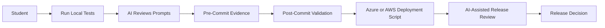
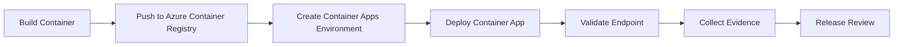
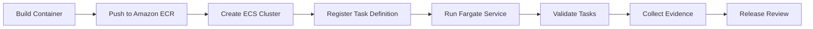

# Lab 11 - Testing, Deployment and Agentic SDLC Operations

**Course:** Advanced Software Development with Agentic AI (ASD)
**Theme:** Testing, Deployment and Agentic SDLC Operations
**Primary IDE:** VS Code
**Optional IDE:** AWS Kiro may be used as an IDE only. The lab setup and commands are written for VS Code.
**AI Agent Runtime:** Ollama
**Duration:** 60 Minutes

---

## 1. Overview

<details>
<summary>Goal</summary>

Validate the completed Student Enrolment System before cloud deployment.

The validated application will later be deployed to:

```text
Azure Container Apps
AWS ECS Fargate
```

Use the exact deployment scripts `scripts/lab11/deploy-azure.sh` and `scripts/lab11/deploy-aws.sh`. Their full bodies are documented in the Azure Configuration and AWS Configuration subsections of [docs/AI_Agent_Configuration_Guide.md](../docs/AI_Agent_Configuration_Guide.md).

</details>

<details>
<summary>Expected Results</summary>

By the end of this lab, students should have:

* automated service tests
* multi-agent workflow tests
* test report generation
* deployment validation evidence
* AI-assisted release review

</details>

<details>
<summary>AI-Assisted Workflow</summary>



</details>

<details>
<summary>Lab 11 Script Files</summary>

* `scripts/lab11/local-test.sh` - runs the local Lab 11 test flow
* `scripts/lab11/pre-commit-tests.sh` - runs the pre-commit validation flow
* `scripts/lab11/post-commit-tests.sh` - runs the post-commit validation flow and generates evidence
* `scripts/lab11/deploy-azure.sh` - deploys the app to Azure Container Apps
* `scripts/lab11/deploy-aws.sh` - deploys the app to AWS ECS Fargate with Terraform

The exact Azure and AWS deployment script bodies are documented in the Azure Configuration and AWS Configuration subsections of [docs/AI_Agent_Configuration_Guide.md](../docs/AI_Agent_Configuration_Guide.md).

</details>

---

## 2. Prerequisites and Configuration

<details>
<summary>Prerequisite Labs</summary>

This lab assumes that students have already completed:

* Lab 01
* Lab 02
* Lab 03
* Lab 04
* Lab 05
* Lab 06
* Lab 07
* Lab 08
* Lab 09
* Lab 10

</details>

<details>
<summary>Required Tools</summary>

### Required

* Docker Desktop
* Python
* Git
* VS Code
* Ollama

### Optional

* AWS Kiro

</details>

<details>
<summary>Service Configuration</summary>

```env
FRONTEND_URL=http://localhost:8080
ENROLMENT_SERVICE_URL=http://localhost:5001
DATABASE_SERVICE_URL=http://localhost:5002
MULTI_AGENT_SERVICE_URL=http://localhost:5004
```

</details>

<details>
<summary>Model Configuration</summary>

```env
OLLAMA_BASE_URL=http://localhost:11434/v1
OLLAMA_MODEL=qwen2.5:0.5b
OLLAMA_REVIEW_MODEL=llama3.1:8b
```

</details>

<details>
<summary>Cloud Deployment Profile</summary>

Use the reduced runtime profile for Azure Container Apps and AWS ECS Fargate:

```env
MCP_ENABLED=false
RAG_ENABLED=false
```

AI Mode remains enabled in the backend by default. MCP, RAG, and the multi-agent service remain off for cloud deployment to avoid unnecessary VM load.

</details>

<details>
<summary>Agent Roles</summary>

| Agent          | Role                 | Purpose                                               |
| -------------- | -------------------- | ----------------------------------------------------- |
| Planner Agent  | Test Planning        | Identify release validation scope                     |
| Worker Agent   | Test Assistance      | Execute validation workflow                           |
| Reviewer Agent | Risk Review          | Review failures and risks                             |
| Human          | Final Decision Maker | Accept, partially accept, or reject release readiness |

</details>

---

## 3. Scenario Setup

<details>
<summary>Scenario</summary>

The Student Enrolment System contains:

* frontend-service
* enrolment-service
* database-service
* mcp-server
* rag-server
* multi-agent-server

The application must be validated before deployment to Azure Container Apps and AWS ECS Fargate.

</details>

<details>
<summary>User Story</summary>

```text
As a release reviewer
I want automated service and workflow tests
So that deployment decisions are based on evidence.
```

</details>

<details>
<summary>Expected Behaviour</summary>

The validation process must confirm:

* frontend service is reachable
* enrolment service is reachable
* database service returns student records
* enrolment service retrieves students by subject
* multi-agent workflow executes successfully
* workflow status records evidence
* test results are generated
* audit evidence is generated

</details>

<details>
<summary>Project Structure</summary>

```text
enrolment-app-open-ai/
│
├── .github/
│   └── workflows/
│       ├── lab5-ci.yml
│       ├── lab11_cicd_aws.yaml
│       └── lab11_cicd_azure.yaml
│
├── deployment/
│   ├── aws/
│   │   ├── main.tf
│   │   └── variables.tf
│   └── azure/
│       └── aca-template.json
│
├── frontend-service/
├── enrolment-service/
├── database-service/
├── mcp-server/
├── rag-server/
├── multi-agent-server/
│
├── prompts/
│   ├── lab11_pre_commit_test_prompt.txt
│   ├── lab11_post_commit_test_prompt.txt
│   ├── lab11_deployment_review_prompt.txt
│   └── lab11_release_review_prompt.txt
│
├── reports/
│   └── lab11/
│
├── scripts/
│   └── lab11/
│       ├── local-test.sh
│       ├── pre-commit-tests.sh
│       ├── post-commit-tests.sh
│       ├── deploy-azure.sh
│       └── deploy-aws.sh
│
└── tests/
  └── lab11/
    ├── pre_commit/
    │   ├── test_frontend_service.py
    │   └── test_enrolment_service.py
    └── post_commit/
      ├── test_database_service.py
      ├── test_multi_agent_server.py
      └── generate_test_report.py
```

</details>

## 4. Testing Implementation

<details>
<summary>Lab 10 to Lab 11 Upgrade</summary>

If you already have the Lab 10 project, use the target structure in the project tree above and create the Lab 11 files listed there.

</details>

<details>
<summary>Dependencies</summary>

Create the Lab 11 testing workspace and install the test runtime using the steps in the repository scripts and the command tables in [docs/AI_Agent_Configuration_Guide.md](../docs/AI_Agent_Configuration_Guide.md).

</details>

<details>
<summary>Pre-Commit Tests</summary>

Generate prompts:

```text
prompts/lab11_pre_commit_test_prompt.txt
```

Fallback pytest code:

```text
tests/lab11/pre_commit/test_frontend_service.py
tests/lab11/pre_commit/test_enrolment_service.py
```

Use the pre-commit runner script at `scripts/lab11/pre-commit-tests.sh` and the prompt file above.

</details>

<details>
<summary>Post-Commit Tests</summary>

Generate prompts:

```text
prompts/lab11_post_commit_test_prompt.txt
```

Fallback pytest code:

```text
tests/lab11/post_commit/test_database_service.py
tests/lab11/post_commit/test_multi_agent_server.py
tests/lab11/post_commit/generate_test_report.py
```

Use the post-commit runner script at `scripts/lab11/post-commit-tests.sh` and the prompt file above.

Generated evidence:

```text
reports/lab11/test-results.md
reports/lab11/test-audit.jsonl
```

</details>

<details>
<summary>AI-Assisted Test Review</summary>

Use the review prompt:

```text
prompts/lab11_release_review_prompt.txt
```

Use the multi-agent workflow endpoint described in the Lab 10 architecture and the prompt file above.

</details>

---

## 5. Deployment Implementation

<details>
<summary>Dependencies</summary>

Verify required tools using the install and verification steps in [docs/AI_Agent_Configuration_Guide.md](../docs/AI_Agent_Configuration_Guide.md).

</details>

<details>
<summary>Deployment Profile</summary>

Use this runtime profile for cloud deployment:

```env
MCP_ENABLED=false
RAG_ENABLED=false
OLLAMA_BASE_URL=http://host.docker.internal:11434/v1
OLLAMA_MODEL=qwen2.5:0.5b
OLLAMA_REVIEW_MODEL=llama3.1:8b
```

AI Mode remains enabled in the backend by default. MCP, RAG, and the multi-agent service remain off for cloud deployment to avoid unnecessary VM load.

</details>

<details>
<summary>Azure Container Apps</summary>



<details>
<summary>Task 0 - Azure CI Workflow</summary>

Use [/.github/workflows/lab11_cicd_azure.yaml](/home/george/GitHub/agentic-ai-asd-2026/.github/workflows/lab11_cicd_azure.yaml) for the Azure CI workflow.

</details>

<details>
<summary>Task 1 - Azure Deployment</summary>

Create:

```text
deployment/azure/aca-template.json
```

```json
{
  "$schema": "https://schema.management.azure.com/schemas/2019-04-01/deploymentTemplate.json#",
  "contentVersion": "1.0.0.0",
  "resources": []
}
```

Run `scripts/lab11/deploy-azure.sh`. The full script body is in the Azure Configuration subsection of [docs/AI_Agent_Configuration_Guide.md](../docs/AI_Agent_Configuration_Guide.md).

</details>

<details>
<summary>Task 2 - Azure Validation</summary>

Use the Azure validation commands that follow `scripts/lab11/deploy-azure.sh` in the Azure Configuration subsection of [docs/AI_Agent_Configuration_Guide.md](../docs/AI_Agent_Configuration_Guide.md).

</details>

<details>
<summary>Task 3 - Azure Evidence and Review</summary>

Create:

```text
reports/lab11/deployment-results.md
```

```markdown
# Lab 11 Deployment Report

## Azure Container Apps

Deployment Status:

Container App URL:

Validation Result:

Reviewer Notes:

---

## AWS ECS Fargate

Deployment Status:

Cluster:

Service:

Validation Result:

Reviewer Notes:

---

## Release Readiness

Azure Ready:

AWS Ready:

Decision:
```

Run the review prompt described in the configuration guide and record the result in the deployment report. The prompt uses the release review workflow, not a general deployment summary.

</details>

</details>

<details>
<summary>AWS ECS Fargate</summary>



<details>
<summary>Task 0 - AWS CI Workflow</summary>

Use [/.github/workflows/lab11_cicd_aws.yaml](/home/george/GitHub/agentic-ai-asd-2026/.github/workflows/lab11_cicd_aws.yaml) for the AWS CI workflow.

</details>

<details>
<summary>Task 1 - AWS Deployment</summary>

Create:

```text
deployment/aws/main.tf
deployment/aws/variables.tf
```

Use the Terraform files already created in the repository. The expected task definition is:

```terraform
terraform {
  required_version = ">= 1.5"
}

provider "aws" {
  region = "ap-southeast-2"
}

resource "aws_ecs_cluster" "lab11" {
  name = "lab11-cluster"
}

resource "aws_ecs_task_definition" "enrolment" {
  family                   = "enrolment-service"
  requires_compatibilities = ["FARGATE"]
  network_mode             = "awsvpc"
  cpu                      = 256
  memory                   = 512
  execution_role_arn       = var.execution_role_arn

  container_definitions = jsonencode([
    {
      name      = "enrolment-service"
      image     = var.image
      essential = true
      portMappings = [
        {
          containerPort = 5001
          hostPort      = 5001
        }
      ]
    }
  ])
}

resource "aws_ecs_service" "enrolment" {
  name            = "enrolment-service"
  cluster         = aws_ecs_cluster.lab11.id
  task_definition = aws_ecs_task_definition.enrolment.arn
  desired_count   = 1
  launch_type     = "FARGATE"

  network_configuration {
    assign_public_ip = true
    security_groups  = [var.security_group_id]
    subnets          = var.subnet_ids
  }
}
```

Run `scripts/lab11/deploy-aws.sh`. The full script body is in the AWS Configuration subsection of [docs/AI_Agent_Configuration_Guide.md](../docs/AI_Agent_Configuration_Guide.md).

</details>

<details>
<summary>Task 2 - AWS Validation</summary>

Use the AWS validation commands that follow `scripts/lab11/deploy-aws.sh` in the AWS Configuration subsection of [docs/AI_Agent_Configuration_Guide.md](../docs/AI_Agent_Configuration_Guide.md).

</details>

<details>
<summary>Task 3 - AWS Evidence and Review</summary>

Use the same deployment evidence template in reports/lab11/deployment-results.md and the review prompt in prompts/lab11_deployment_review_prompt.txt.

Use the multi-agent workflow review path described in the test review section above.

</details>

</details>

---

## 6. Application Testing

<details>
<summary>Functional Validation</summary>

Validate local and cloud deployment using the service endpoints and validation guidance already listed in the configuration guide. Confirm that the frontend, enrolment service, database service, multi-agent workflow, Azure endpoint, and AWS endpoint all respond successfully.

</details>

<details>
<summary>Non-Functional Validation</summary>

Use the response-time, availability, and cloud-endpoint targets described in the lab brief and record the results in the report template.

</details>

<details>
<summary>Validation Method</summary>

Use a repeated-request sample and record the average response time, success count, and failure count in the release report.

</details>

<details>
<summary>Release Readiness Validation</summary>

Confirm the local tests, deployment evidence, Azure validation, AWS validation, and review outcomes before marking the release ready or not ready.

</details>

---


## 7. Release Workflow

<details>
<summary>Release Workflow</summary>

Select either Azure Container Apps or AWS ECS Fargate for the release workflow. The workflow runs tests, deploys the selected target, validates the deployment, performs review, and then records the release decision.

</details>

<details>
<summary>Task 1 - Execute Release Workflow</summary>

Use the generated test-report and audit files in `reports/lab11/` and verify that the release evidence is complete.

</details>

<details>
<summary>Task 2 - Validate Selected Deployment</summary>

Validate the selected cloud endpoint using the exact deployment script you chose (`scripts/lab11/deploy-azure.sh` or `scripts/lab11/deploy-aws.sh`) and record the HTTP 200 result.

</details>

<details>
<summary>Task 3 - AI-Assisted Release Review</summary>

Use the multi-agent review workflow described earlier in the lab and record the release assessment result.

</details>

<details>
<summary>Task 4 - Failure Recovery</summary>

Introduce ONE failure.

Examples:

```text
Invalid Endpoint

Invalid Container Image

Failed Validation Check
```

Execute validation again.

Observe failure.

Correct the issue.

Re-run validation.

Expected:

```text
Failure Detected

Failure Corrected

Validation Successful
```

</details>

<details>
<summary>Release Success Criteria</summary>

```text
All Tests Passed

Deployment Successful

Deployment Validation Successful

Release Review Completed
```

Final Outcome:

```text
Release Ready

or

Release Not Ready
```

</details>

---

## 8. Evidence Log

<details>
<summary>Record Evidence</summary>

| Check | Expected Result | Actual Result | Pass/Fail |
|---------|---------|---------|---------|
| Frontend Tests Passed | Yes | | |
| Enrolment Tests Passed | Yes | | |
| Database Tests Passed | Yes | | |
| Multi-Agent Tests Passed | Yes | | |
| Test Report Generated | Yes | | |
| Audit Evidence Generated | Yes | | |
| Cloud Deployment Successful | Yes | | |
| Cloud Validation Successful | Yes | | |
| Release Review Completed | Yes | | |
| Failure Recovery Completed | Yes | | |

</details>

---

## 9. Reflection

<details>
<summary>Answer Briefly</summary>

1. Which test provided the highest confidence in system quality?

2. Which deployment validation was most valuable?

3. What failure was introduced during release validation?

4. How was the failure identified?

5. How was the failure corrected?

6. What did the release review identify?

7. What would you automate next in the release workflow?

</details>

---

## 10. Key Learning Point

<details>
<summary>Learning Outcome</summary>

A release workflow validates software before production deployment.

```text
Test
→ Deploy
→ Validate
→ Review
→ Recover
→ Release
```

Successful releases require:

```text
Automated Testing

Deployment Validation

Failure Recovery

Evidence Collection

Release Review
```

Deployment success alone does not prove release readiness.

Release decisions must be supported by validation evidence.

</details>